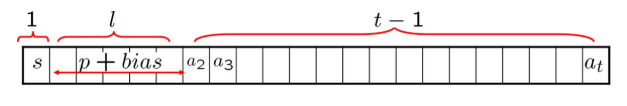
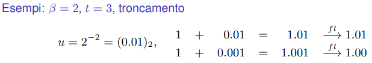
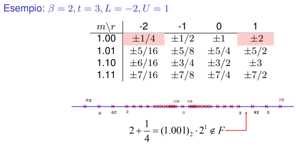

## Rappresentazione in formato floating point (Slides 44-95)

Punto di partenza &rArr; esprimere il numero $\alpha$ in *forma scientifica normalizzata* nella base $\beta$ (nel nostro caso $\beta=2$):

$$
\alpha = segno(\alpha) \times (0.a_1a_2\ldots a_ta_{t+1}\ldots)_{\beta} \times \beta^r
$$

Per i limiti finiti della memoria del calcolatore avremo

1. un numero finito di cifre $t$ per rappresentare la *mantissa*
2. un *limite superiore* $U$ e un *limite inferiore* $L$ per rappresentare l'*esponente* $r$.

Pertanto, il formato *floating point* dipende da 4 parametri: $\beta$, $t$, $L$ e $U$. Fissati questi parametri, si definisce l'*insieme* dei numeri floating point.

$$
F(\beta, t, L, U) = \{\pm(0.a_1 a_2 ... a_t)_{\beta} \beta^r : a_i \in \{0, ..., \beta - 1\}, \forall i = 1, ..., t, a_1 \neq 0, r \in \mathbb{Z}, L \le r \le U\}
$$

* insieme discreto e finito di numeri reali.
* simmetrico rispetto all'origine.
* la sua cardinalità è data da $2(\beta - 1)\beta^{t-1}(U - L + 1)$, che si ottiene contando tutte le possibili combinazioni di mantissa ed esponente.

---

*Caso $\beta = 2$*

La normalizzazione nel caso binario implica necessariamente $a_1 = 1$. In altri termini, ogni numero reale ha un'unica rappresentazione binaria nella forma

$$
\alpha = \pm(1.a_2...a_t a_{t+1}...)_2 2^r
$$

In questo caso l'insieme dei numeri floating point si scrive come

$$
F(2, t, L, U) = \{\pm(1.a_2...a_t)_2 2^r : a_i \in \{0, 1\}, \forall i = 2, ..., t, r \in \mathbb{Z}, L \le r \le U\}
$$

* Il numero più grande dell'insieme è

  $$
  (1.1...1)_2 2^U = (2 - 2^{1-t})2^U
  $$
* Il numero più piccolo in valore assoluto è

  $$
  (1.0...0)_2 2^L = 2^L
  $$

**(Vedere ESEMPIO SLIDE 47-48)**

---

### Formati standard IEEE 754

|                                                                                        | Semplice precisione                                                          | Doppia precisione                                                                    |
| -------------------------------------------------------------------------------------- | ---------------------------------------------------------------------------- | ------------------------------------------------------------------------------------ |
| N bit segno $s$   $t-1$   $l$ bias  $U$  $L$ | 32 (4 byte) 1 bit 23 8 127 (01111111) 127 -126 | 64 (8 byte) 1 bit 52 11 1023 (01111111111) 1023 -1022 |

> **Esempio**: Rappresentazione floating point di $\alpha = 12.3125$ in formato a semplice precisione.
>
> $(12.3125)_{10} = (1100.0101)_2 = (1.1000101)_2 \times 2^3$  
> $p = 3 \Rightarrow p + bias = 3 + 127 = 130$  
> $130_{10} = (10000010)_2$  
> $0 - 10000010 - 10001010000000000000000$

Un numero reale che non appartiene all'insieme $F$ viene rappresentato al suo interno per *arrotondamento* oppure per *troncamento* della sua mantissa alla $t$-esima cifra.

**Vedere ESEMPIO SLIDE 51-52**

---

**ERRORE DI RAPPRESENTAZIONE (slide 54)**  
Ogni volta che un numero reale viene rappresentato in virgola mobile con precisione finita ($t$ fissato), se questo non appartiene all’insieme $F(β, t, L, U)$ si ha una perdita di informazione, ossia si commette un **errore**. La motivazione fondante dell’analisi numerica è la necessità di valutare problemi matematici e relativi algoritmi tenendo conto di questi errori.

---

**ERRORE ASSOLUTO ed ERRORE RELATIVO**  
Sia $\alpha$ un numero reale. L'**errore assoluto** commesso approssimando $\alpha$ con un altro numero reale $\alpha^*$ è definito come 

$$
E_a = |\alpha - \alpha^*|
$$

L'**errore relativo** è definito come 

$$
E_r = \frac{E_a}{|\alpha|} \quad \text{se } \alpha \neq 0
$$

---

### La precisione di macchina

> **Teorema dell'errore di rappresentazione dei numeri reali**  
> Sia $\alpha$ un numero reale e $fl(\alpha)$ la sua rappresentazione in virgola mobile in base $\beta$, con $t$ cifre di precisione per la mantissa. L'errore relativo commesso approssimando $\alpha$ con $fl(\alpha)$ è limitato superiormente da $\beta^{1-t}$, ossia
> $$ E_r = \frac{|\alpha - fl(\alpha)|}{|\alpha|} \le \beta^{1-t} $$
> - La quantità $u = \beta^{1-t}$ è chiamata **precisione di macchina** ed è un limite superiore per l'errore relativo commesso approssimando un numero reale con la sua rappresentazione in virgola mobile.
> - Un modo equivalente per esprimere la stessa stima è $fl(\alpha) = \alpha (1 + \epsilon), |\epsilon| \le \beta^{1-t}$

La precisione di macchina $u$ è un parametro fondamentale per l'analisi numerica, poiché fornisce una stima dell'errore relativo massimo che si può commettere quando si rappresenta un numero reale in virgola mobile. Conoscere $u$ permette di valutare la stabilità numerica degli algoritmi e di prevedere la possibile perdita di precisione durante i calcoli. In altre parole, $u$ può essere definita anche come il più piccolo numero reale tale che $fl(1 + u) \neq 1$.

---

## Operazioni con i numeri floating point

L'insieme $F$ non è chiuso rispetto alle operazioni aritmetiche di base (somma, differenza, prodotto e quoziente). Pertanto, quando si eseguono queste operazioni su numeri in virgola mobile, il risultato potrebbe non appartenere all'insieme $F$, e quindi deve essere approssimato con un numero in $F$.
Rispetto ai numeri in fixed point, oltre ai casi di overflow e underflow, si possono verificare errori di arrotondamento o troncamento, che portano a una perdita di precisione. Come nel seguente esempio:

- abbiamo a che fare con un'aritmetica in cui le operazioni vengono ridefinite in modo che il risultato appartenga all'insieme $F$
- il risultato di un’operazione tra numeri dell’insieme F è un numero reale: il risultato dell’operazione di macchina corrispondente è la rappresentazione floating point di esso
- Conseguenza dell’ultimo passaggio che definisce le operazioni di macchina è l’introduzione di un potenziale errore che capita ogni volta che il risultato dell’operazione non appartiene ad F e deve quindi essere arrotondato o troncato alla $t$-esima cifra della mantissa

> **Errore di rappresentazione del risultato di un'operazione**  
> Siano $x, y \in F(\beta, t, L, U)$. Indichiamo genericamente con $\bullet$ una qualsiasi delle quattro operazioni aritmetiche di base. L'errore relativo commesso approssimando il risultato dell'operazione $x \bullet y$ con la sua rappresentazione in virgola mobile è limitato superiormente da $\beta^{1-t}$, ossia soddisfa la disuguaglianza 
> $$ \frac{|x \bullet y - fl(x \bullet y)|}{|x \bullet y|} \le \beta^{1-t} $$
>
> Si può scrivere in forma equivalente come $fl(x \bullet y) = (x \bullet y)(1 + \epsilon), |\epsilon| \le \beta^{1-t}$

---
**Nota importante**  
Il calcolatore ha a disposizione un insieme limitato e finito di numeri reali, ha un'aritmetica diversa dalla nostra e commette potenziali errori di rappresentazione ogni qualvolta che si assegna un valore reale ad una variabile in semplice o doppia precisione, oppure ogni volta che si esegue un'operazione aritmetica tra numeri in virgola mobile. Pertanto, è fondamentale tenere conto di questi errori quando si progettano algoritmi numerici, al fine di garantire la stabilità e l'affidabilità dei risultati ottenuti.

---

**(VEDERE ESEMPI SLIDES 63-64-65)**

> **Errore di incolonnamento**  
> La somma di due addendi entrambi non nulli ha dato come risultato il più grande, in valore assoluto, dei due. Questa situazione di verifica quando $$ |y| \leq \frac{u}{\beta} |x| $$

L'errore di incolonnamento significa che per la somma floating point *non c'è un unico elemento neutro*. Infatti, se $|y|$ è sufficientemente piccolo rispetto a $|x|$, la somma $x + y$ potrebbe essere approssimata da $x$ stesso, portando a una perdita di precisione. In altre parole, quando si sommano due numeri in virgola mobile, se uno dei numeri è molto più piccolo dell'altro, il risultato potrebbe essere dominato dal numero più grande, e il contributo del numero più piccolo potrebbe essere trascurato a causa della limitata precisione della rappresentazione in virgola mobile.

*Non validità* delle seguenti proprietà algebriche:
- associativa di somma e prodotto: $(x + y) + z \neq x + (y + z)$, $(x \cdot y) \cdot z \neq x \cdot (y \cdot z)$ **(VEDERE ESEMPIO SLIDE 67-68)**
- distributiva: $x \cdot (y + z) \neq x \cdot y + x \cdot z$ **(VEDERE ESEMPIO SLIDE 69)**
- legge di annullamento del prodotto: $x \cdot y = 0$ non implica necessariamente $x = 0$ o $y = 0$ **(VEDERE ESEMPIO SLIDE 70)**

## Analisi degli errori

**Analisi dei problemi e degli algoritmi numerici**  

Gli algoritmi numerici:
- vengono applicati per calcolare le soluzioni di problemi matematici;
- i dati in input, che vengono elaborati tramite una successione di operazioni, e i risultati in output sono numeri reali
- vengono eseguiti dal calcolatore

> *Attenzione*:
> - i dati in input sono affetti da errori di rappresentazione, poiché vengono approssimati con numeri in virgola mobile (*dati perturbati*);
> - i risultati di ogni singola operazione sono affetti da errori di rappresentazione, poiché vengono approssimati con numeri in virgola mobile (*aritmetica di macchina*);
> - ogni risultato intermedio può esserne soggetto e influenzare i risultati di tutte le operazioni successive
> L’accumulo di questi errori viene chiamato *propagazione degli errori*

Compiti dell'analisi numerica:
- Analisi del **condizionamento dei problemi**: analizzare i problemi matematici per capire quanto le relative soluzioni variano in presenza di perturbazioni dei dati $\rightarrow$ permette una opportuna interpretazione delle soluzioni calcolate mediante algoritmi numerici
- Analisi della **stabilità degli algoritmi**: progettare algoritmi numerici che risentano poco degli effetti dell'aritmetica di macchina

**(Vedere ESEMPIO SLIDE 75-76)**

> **ERRORE INERENTE**  
> è l'errore che si commetterebbe se le operazioni fossero eseguite in aritmetica esatta ($\epsilon_{1} = \epsilon_{2} = ... = \epsilon_{n} = 0$).
> - NON dipende dall'algoritmo ma solo dai dati e da *come essi sono legati alle soluzioni* del problema.

> **ERRORE ALGORITMICO**  
> è l'errore che si commetterebbe se i dati fossero rappresentati esattamente ($\epsilon_{x} = \epsilon_{y} = \epsilon_{z} = 0$) ma le operazioni fossero eseguite in precisione finita
> - dipende dall'algoritmo e dai dati.

> **CONDIZIONAMENTO**  
> Un problema si dice ben condizionato se a piccole perturbazioni dei dati corrispondono altrettanto piccole variazioni delle soluzioni. Viceversa, un problema si dice mal condizionato se a piccole perturbazioni dei dati corripondono (relativamente) grandi variazioni delle soluzioni.
> - il condizionamento è una proprietà della funzione che lega i dati alla soluzione di un problema, non dipende da come queste vengano calcolate.  
> *Esempio slide 79.*

> **STABILITÀ**  
> Un algoritmo si dice stabile se non è troppo sensibile agli errori di rappresentazione introdotti dalle operazioni in aritmetica finita. Viceversa, un algoritmo si dice instabile se tende ad amplificare gli errori dovuti all’aritmetica finita.
> - la stabilità dipende dal tipo, dall'ordine delle operazioni che costituiscono l'algoritmo.  
> *Esempi slide 81, 82, 83.*

### Valutazione degli algoritmi

Criteri di valutazione degli algoritmi numerici:
1. **Complessità computazionale** = numero di operazioni aritmetiche necessarie per portare a termine l'algoritmo.
    - il *tempo di calcolo* è direttamente proporzionale alla complessità computazionale;
    - fornisce una valutazione dell'*efficienza* dell'algoritmo indipendente dal processore.
2. **Stabilità** = capacità dell'algoritmo di *non amplificare troppo* gli errori dovuti alle operazioni di macchina.

**Un tragico caso di cronaca bellica** $\rightarrow$ *Vedere slide 87 - 95*