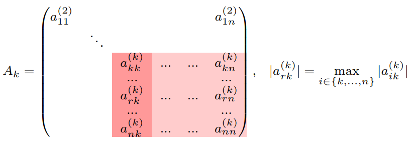

# Metodi Numerici: Risoluzione di Sistemi Lineari

## Definizione del Problema

Dato un sistema di equazioni lineari, l'obiettivo è determinare il vettore delle incognite che soddisfi contemporaneamente tutte le equazioni del sistema.

### Formulazione Matriciale

Sia $A \in \mathbb{R}^{n \times n}$ la **matrice dei coefficienti** e $b \in \mathbb{R}^n$ il **vettore dei termini noti**:

$$
A = \begin{pmatrix}
a_{11} & a_{12} & \cdots & a_{1n} \\
a_{21} & a_{22} & \cdots & a_{2n} \\
\vdots & \vdots & \ddots & \vdots \\
a_{n1} & a_{n2} & \cdots & a_{nn}
\end{pmatrix}, \quad
b = \begin{pmatrix}
b_1 \\
b_2 \\
\vdots \\
b_n
\end{pmatrix}
$$

Si vuole calcolare il vettore $x \in \mathbb{R}^n$ che soddisfa l'uguaglianza:

$$
Ax = b
$$

### Forma Esplicita

Il sistema può essere scritto per esteso come:

$$
\begin{cases}
a_{11}x_1 + a_{12}x_2 + a_{13}x_3 + \dots + a_{1n}x_n &= b_1 \\
a_{21}x_1 + a_{22}x_2 + a_{23}x_3 + \dots + a_{2n}x_n &= b_2 \\
\vdots & \vdots \\
a_{n1}x_1 + a_{n2}x_2 + a_{n3}x_3 + \dots + a_{nn}x_n &= b_n
\end{cases}
$$

> **Esistenza ed unicità della soluzione (Teorema di Rouché-Capelli)**  
> Se A è nonsingolare (ovvero $\det(A) \neq 0$), allora il sistema $Ax = b$ ammette una soluzione unica.

Ricordiamo le seguenti proprietà equivalenti:

1. $A$ è invertibile.
2. $\det(A) \neq 0$.
3. le righe e le colonne di $A$ sono linearmente indipendenti.
4. $Ax = 0$ se e solo se $x = 0$.

---

**Suggerimento per uno studio efficace (sistemi lineari):**

- Quali sono i dati? Cosa si vuole calcolare? [Dati: $A \in \mathbb{R}^{n \times n}$, $b \in \mathbb{R}^n$; Soluzione: trovare $x \in \mathbb{R}^n$ tale che $Ax = b$]
- Discussione delle proprietà della\delle soluzioni:
  1. Esistenza e unicità, ipotesi [Se $A$ è non singolare, allora esiste una soluzione unica]
  2. Condizionamento [Il condizionamento del problema dipende dalla matrice dei coefficienti $A$: se il numero di condizionamento $k(A)= \|A\| \|A^{-1}\|$ è grande, il sistema è mal condizionato]
- Presentazione degli algoritmi, delle loro proprietà:
  1. Complessità computazionale
  2. Stabilità
  3. Confronto tra algoritmi
- Implementazione (in Python)

**Metodi numerici per la soluzione di sistemi lineari:**

- **Metodi Diretti:** (es. Eliminazione Gaussiana, Fattorizzazione LU, Cholesky). Forniscono la soluzione in un numero finito di operazioni.
- **Metodi Iterativi:** (es. Jacobi, Gauss-Seidel). Costruiscono una successione di vettori $x^{(k)}$ che all'infinito converge alla soluzione $x$.

---

## Metodo di Gauss (Eliminazione Gaussiana) $\rightarrow$ slide 144

Dato il sistema lineare $Ax = b$, il metodo di Gauss consiste in due fasi principali:

- Fase 1 $\rightarrow$ Procedimento di **eliminazione (o fattorizzazione) di Gauss**: si calcola una *matrice triangolare inferiore* $L$ e una *matrice triangolare superiore* $U$ tali che
  $$
  A = LU
  $$
- Fase 2 $\rightarrow$ Costruzione e soluzione di due sistemi triangolari equivalenti a quello iniziale. Si riprende l'uguaglianza $A = LU$ e si riscrive il sistema come
  $$
  LUx = b \quad \Rightarrow \quad \begin{cases} Ly = b & \text{(sostituzione in avanti)} \\ Ux = y & \text{(sostituzione all'indietro)} \end{cases}
  $$

**Teorema di fattorizzazione di Gauss**  
Se tutti i *minori principali* (cioè i determinanti delle sottomatrici di ordine k) di $A$ sono non nulli, tranne al più l'ultimo, ($A^{(k)} \neq 0, k = 1, \dots, n-1$), allora esiste una matrice triangolare inferiore $L$ con diagonale unitaria e una matrice triangolare superiore $U$ tali che $A = LU$. Inoltre si ha

$$
A^{(k)} = u_{11} u_{22} \cdots u_{kk}, k = 1, \dots, n-1
$$

Le matrici che soddisfano le *ipotesi* del teorema di fattorizzazione di Gauss sono le **matrici strettamente a diagonale dominante** per righe o per colonne, ovvero quelle matrici $A$ tali che:

$$
|a_{ii}| > \sum_{j \neq i} |a_{ij}|, \quad i = 1, \dots, n
$$

In altre parole, la matrice è strettamente a diagonale dominante se in ogni riga (o colonna) il modulo dell'elemento sulla diagonale principale è maggiore della somma dei moduli degli altri elementi della stessa riga (o colonna).

> **Osservazione:** Non tutte le matrici invertibili hanno tutti i minori principali diversi da zero. Per esempio:
>
> $$
> A = \begin{pmatrix}0 & 1 \\ 1 & 0 \end{pmatrix}
> $$

**Teorema di fattorizzazione di Gauss con scambio di righe**  
Se $A$ è nonsingolare, allora esiste una matrice di permutazione $P$, una matrice triangolare inferiore $L$ con diagonale unitaria e una matrice triangolare superiore $U$ tali che $PA = LU$.

> **Strategia di pivoting parziale**  
> Al passo $k$, si sceglie come pivot l'elemento più grande in valore assoluto della prima colonna della sottomatrice $\tilde{A}^{(k)}$.
> 
>
> **Conseguenza del pivoting parziale**  
> $ |m_{ik}| \leq 1, \forall k = 1, \dots, n-1, \forall i = k+1, \dots, n $
>
> **Costo computazionale del pivoting parziale**  
> Al passo $k$ occorre effettuare $n-k+1$ confronti, che hanno il costo di una differenza
>
> $$
> \sum_{k=1}^{n-1} k + 1 \simeq \mathcal{O}\left( \frac{n^2}{2} \right)
> $$

---

**Matrici simmetriche definite positive**  
Sono matrici *simmetriche* che godono delle seguenti proprietà caratteristiche:

- $x^T A x \geq 0, \forall x \in \mathbb{R}^n$ e $x^T A x = 0 \iff x = 0$
- tutti i minori principali sono positivi
- tutti gli autovalori sono reali positivi

### Teorema di fattorizzazione di Cholesky  

> Una matrice simmetrica $A \in \mathbb{R}^{n \times n}$ è definita positiva se e solo se esiste una matrice triangolare inferiore $L$ con diagonale positiva tale che $A = LL^T$.  
> Complessità computazionale: $\mathcal{O}\left( \frac{n^3}{6} \right)$ a cui si aggiungono $n$ estrazioni di radice quadrata.

---

### Teorema di fattorizzazione $QR$  

> Sia $A \in \mathbb{R}^{n \times n}$ una matrice non singolare. Allora esistono una matrice ortogonale $Q \in \mathbb{R}^{n \times n}$ e una matrice triangolare superiore $R \in \mathbb{R}^{n \times n}$ tali che $A = QR$.  

L'algoritmo per il calcolo delle matrici $Q$ e $R$ che useremo è basato su **trasformazioni elementari di Householder**.  

> **Definizione**  
> Dato un vettore $v \in \mathbb{R}^n$, $v \neq 0$, si definisce trasformazione elementare di Householder associata a $v$ la matrice
>
> $$
> U = I - \frac{1}{\alpha} vv^T
> $$
>
> dove $\alpha = \frac{1}{2} \|v\|_2^2$, $v$ vettore colonna e $v^T$ vettore riga (vettore trasposto).

L'idea è quella di utilizzare le trasformazioni di Householder (come quelle di Gauss) per eliminare gli elementi del triangolo inferiore della matrice $A$:

$$
U_{n-1} \cdots U_2 U_1 A = R
$$

Al passo $k$, la matrice $U_k$ è definita in modo che nel prodotto vengano eliminati tutti gli elementi della colonna $k$, sulle righe $k+1, \dots, n$ (cioè tutti gli elementi della colonna $k$ al di sotto della diagonale).

**Eliminazione delle componenti di un vettore mediante trasformazioni di Householder**  

> **Proprietà**  
> Dato $z \in \mathbb{R}^n$, $z \neq 0$, e definita $U$ la matrice di Householder associata al vettore $v = z + \sigma e_1$ ($e_1$ è la prima colonna della matrice identità di ordine $n$ e $\sigma = \|z\|$), si ha che
> $$ Uz = -\sigma e_1 = \begin{pmatrix} -\sigma \\ 0 \\ \vdots \\ 0 \end{pmatrix} $$

### Procedimento iterativo per la fattorizzazione (Passo **$k$**)

Per preservare gli zeri creati nei passi precedenti, ad ogni passo **$k$** (con **$k = 1, \dots, n-1$**) non applichiamo la trasformazione all'intera matrice, ma solo alla sottomatrice in basso a destra di dimensione **$(n-k+1) \times (n-k+1)$**.

Definiamo la matrice di trasformazione **$U_k$** come una  **matrice a blocchi** :

$$
U_k = \begin{pmatrix} I_{k-1} & 0 \\ 0 & I_{n-k+1} - \frac{1}{\alpha_k} v_k v_k^T \end{pmatrix}
$$

Dove:

* **$I_{k-1}$** è la matrice identità che lascia inalterate le prime **$k-1$** righe e colonne (già sistemate nei passi precedenti).
* Il blocco in basso a destra è la trasformazione di Householder calcolata sulla porzione della **$k$**-esima colonna che si trova  *dalla diagonale in giù* .

Moltiplicando **$A_{k+1} = U_k A_k$**, azzeriamo tutti gli elementi sotto la diagonale principale della colonna **$k$**-esima. Poiché la matrice originaria **$A$** è non singolare, è garantito che ad ogni passo il vettore da azzerare non sia nullo, permettendo all'algoritmo di procedere.

### Costruzione delle matrici **$Q$** ed **$R$**

Dopo **$n-1$** passi, abbiamo azzerato tutti gli elementi sotto la diagonale principale. La matrice risultante è la nostra matrice triangolare superiore **$R$**: 

$$
U_{n-1} \cdots U_2 U_1 A = R
$$

Per ricavare la scomposizione **$A = QR$**, sfruttiamo due proprietà fondamentali delle matrici di Householder **$U_k$**: sono **ortogonali** (**$U_k^T = U_k^{-1}$**) e **simmetriche** (**$U_k^T = U_k$**). Di conseguenza, l'inversa di **$U_k$** è **$U_k$** stessa.

Moltiplicando a sinistra entrambi i membri per **$(U_{n-1} \cdots U_1)^{-1}$**, otteniamo: 

$$
A = (U_1 U_2 \cdots U_{n-1}) R
$$

Da cui definiamo la matrice **$Q$**: 

$$
Q = U_1 U_2 \cdots U_{n-1}
$$

Essendo il prodotto di matrici ortogonali, anche  **$Q$ è una matrice ortogonale** .

### Generalizzazione: Matrici rettangolari a rango massimo

Il procedimento basato sulle trasformazioni di Householder non è limitato alle matrici quadrate, ma si estende a matrici rettangolari, utile ad esempio nella risoluzione dei problemi ai minimi quadrati.

> **Fattorizzazione di matrici a rango massimo per colonne**
>
> Sia **$A \in \mathbb{R}^{m \times n}$**, con **$m \ge n$**, tale che le sue colonne siano linearmente indipendenti (rango massimo). Allora esiste una matrice ortogonale **$Q \in \mathbb{R}^{m \times m}$** e una matrice triangolare superiore non singolare **$R \in \mathbb{R}^{n \times n}$** tale che:
> $$A = Q \begin{pmatrix} R \\ O \end{pmatrix}$$
> dove **$O \in \mathbb{R}^{(m-n) \times n}$** è una matrice nulla.

*Osservazione*: la fattorizzazione $QR$ ha un costo più elevato rispetto alla fattorizzazione $LU$ (circa il doppio), ma è più stabile numericamente, soprattutto per matrici mal condizionate. Il suo utilizzo è giustificato in casi particolari:
- per problemi di approssimazione di dati sperimentali (ad esempio, problemi dei minimi quadrati)
- quando è necessaria una maggiore stabilità numerica (ad esempio, per matrici mal condizionate)

Soluzione: $Ax = b \iff Q Rx = b$, mettiamo a sistema $$ \begin{cases} y = Q^T b \\ Rx = y \end{cases} $$

---

### Confronto della stabilità degli algoritmi di fattorizzazione
- l'algoritmo di soluzione di un sistema triangolare può diventare instabile quando gli elementi della matrice triangolare diventano 'troppo' grandi
- la stabilità delle fattorizzazioni si definisce individuando dei limiti superiori per gli elementi dei fattori
- si parla di **stabilità forte** se questi limiti sono indipendenti dalle dimensioni della matrice, di **stabilità debole** se i limiti dipendono dalle dimensioni della matrice

In generale: *Gauss con pivoting parziale* e *QR* sono stabili debolmente, ma *QR* è più stabile di *Gauss*. *Cholesky* è fortemente stabile.

| Metodo | Ipotesi | Complessità | Stabilità |
| :--- | :--- | :--- | :--- |
| Gauss con pivoting parziale | $A$ nonsingolare | $\mathcal{O}(\frac{n^3}{3})$ | debole |
| $LDL^T$ | $A$ simm., minori princ. $\neq 0$ | $\mathcal{O}(\frac{n^3}{6})$ | debole |
| Cholesky | $A$ simmetrica, definita positiva | $\mathcal{O}(\frac{n^3}{6})$ | forte |
| $QR$ | colonne di $A$ lin.indip. | $\mathcal{O}(\frac{2n^3}{3})$ | debole |

---

## Note per il Ripasso (Concetti Chiave)

* **Esistenza e Unicità:** Il sistema ammette un'unica soluzione se e solo se la matrice $A$ è non singolare, ovvero $\det(A) \neq 0$ (o equivalentemente, se $A$ ha rango massimo $n$).
* **Metodi di Risoluzione:**
  1. **Metodi Diretti:** (es. Eliminazione Gaussiana, Fattorizzazione LU, Cholesky). Forniscono la soluzione in un numero finito di operazioni.
  2. **Metodi Iterativi:** (es. Jacobi, Gauss-Seidel). Costruiscono una successione di vettori $x^{(k)}$ che converge alla soluzione $x$.
