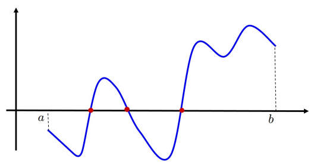
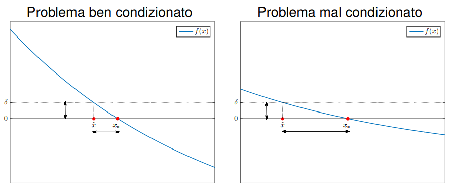
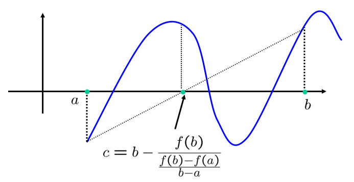
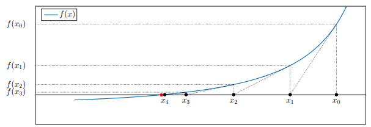
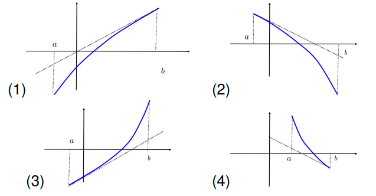
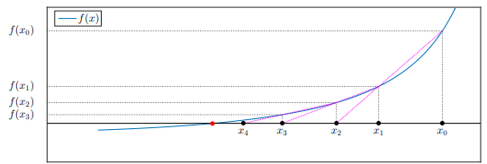

# Metodi per la soluzione di equazioni non lineari

### Definizione del problema

> Sia $f$ una funzione a valori reali ($f:\mathbb{R}\to\mathbb{R}$) definita nell'intervallo $[a,b]$. Il punto $x_* \in [a,b]$ si dice **radice** (o **zero**) della funzione $f$ se 
>
> $$
> f(x_*) = 0
> $$
>



Verifichiamo la presenza di radici tramite il seguente teorema:

> **Teorema del valor medio**: <br>
> Sia $f:[a,b]\to\mathbb{R}$ una funzione continua tale che 
>
> $$
> f(a) \cdot f(b) < 0
> $$
>
>
> Allora esiste *almeno* una radice di $f$ nell'intervallo $[a,b]$, ossia esiste un punto $x_*\in[a,b]$ tale che 
> $$
> f(x_*) = 0
> $$
>
>
> In altre parole, in corrispondenza di $x_*$ la funzione $f$ si annulla, e quindi $x_*$ è una radice di $f$.

**Importante**: Le ipotesi del teorema del valor medio non garantiscono l'unicità della soluzione, ma solo l'esistenza di almeno una radice. Per garantire l'unicità della soluzione, è una condizione sufficiente che la funzione sia strettamente monotona (ad esempio, strettamente crescente o decrescente).

#### Condizionamento del problema

Il mal condizionamento di un problema di equazioni non lineari si ha quando il grafico di $f$ è molto "schiacciato e piatto" sull'asse orizzontale in prossimità della radice.
Se consideriamo un problema perturbato dove $f(x) = \delta$, e approssimiamo il rapporto incrementale come $f'(x_*) \simeq \frac{f(x) - f(x_*)}{x - x_*}$, per un punto perturbato $\tilde{x}$ possiamo scrivere:

$$
|x_* - \tilde{x}| \simeq \frac{|f(x_*) - f(\tilde{x})|}{|f'(x_*)|} = \frac{\delta}{|f'(x_*)|}
$$

Di conseguenza, se $f'(x_*) \approx 0$, anche un errore $\delta$ piccolissimo genera una soluzione $\tilde{x}$ molto distante dalla radice reale $x_*$.



---

> **Sommario**: $f(x) = 0$ <br>
>
> - Condizioni di esistenza delle soluzioni: *Teorema del valor medio* <br>
> - Condizione di unicità della soluzione: *stretta monotonia (condizione sufficiente)* <br>
> - Condizionamento del problema: *se $f'(x_*) \approx 0$ si ha mal condizionamento*
> - Metodi numerici (**iterativi**):
>   1. Bisezione
>   2. Regula Falsi
>   3. Newton (tangenti)
>   4. Secanti <br>
> - Analisi di convergenza dei metodi
> - Definizione di complessità computazionale
> - Definizione di ordine di convergenza

---

## Metodo di bisezione

Come dati abbiamo un intervallo di ricerca $[a,b]$ e come ipotesi una funzione *continua* che assume **segno discorde** agli estremi dell'intervallo, ossia $f(a) \cdot f(b) < 0$. <br>
Questo metodo consiste nell'applicare ripetutamente il teorema del valor medio, generando una successione di intervalli di ampiezza decrescente i cui punti medi convergono ad una radice di $f$. L'obiettivo è applicare iterativamente il problema restringendo man mano il dominio di ricerca $[a,b]$ dove è verificato il problema.

**Meccanismo dell'algoritmo:**

**Passo 1**

- Si calcola il *punto medio* $c_1$ dell'intervallo di ricerca $[a,b] = [a_1,b_1]$;
- Si definisce il nuovo intervallo di ricerca $[a_2,b_2]$ come quello tra i due sottointervalli $[a_1,c_1]$ e $[c_1,b_1]$ in cui sono soddisfatte le ipotesi del teorema del valor medio: 
  $$
  [a_2,b_2] = \begin{cases} [a_1,c_1] & \text{se } f(a_1) \cdot f(c_1) < 0 \\ [c_1,b_1] & \text{se } f(c_1) \cdot f(b_1) < 0 \end{cases}
  $$

**Passo $k$**

- Si calcola il *punto medio* $c_k$ del nuovo intervallo di ricerca $[a_k,b_k]$;
- Si definisce il nuovo intervallo di ricerca $[a_{k+1},b_{k+1}]$ come quello tra i due sottointervalli $[a_k,c_k]$ e $[c_k,b_k]$ in cui sono soddisfatte le ipotesi del teorema del valor medio: 
  $$
  [a_{k+1},b_{k+1}] = \begin{cases} [a_k,c_k] & \text{se } f(a_k) \cdot f(c_k) < 0 \\ [c_k,b_k] & \text{se } f(c_k) \cdot f(b_k) < 0 \end{cases}
  $$

> **Proprietà degli intervalli di ricerca** <br>
> Per ogni $k$, le ipotesi del teorema del valor medio sono verificate in $[a_k,b_k]$, quindi esiste almeno una radice di $f$ in $[a_k,b_k]$. <br>
> L'ampiezza del $k$-esimo intervallo di ricerca è data da 
>
> $$
> b_k - a_k = \frac{b-a}{2^{k-1}}
> $$
>

### Convergenza del metodo di bisezione

> La successione dei punti medi $c_k$ converge ad una radice di $f$ nell'intervallo $[a,b]$ e soddisfa la disuguaglianza: 
>
> $$
> |c_k - x_*| \leq \frac{b-a}{2^k}
> $$
>

Segue che $|c_k - x_*| = O(\frac{1}{2^k})$, ossia la successione dei punti medi converge ad una radice di $f$ con **convergenza lineare**. <br>

**Stima delle iterazioni per una tolleranza $\tau$:**
Fissata una tolleranza $\tau$, possiamo calcolare a priori il numero di passi $k$ minimi necessari per far sì che il nostro errore scenda sotto quella soglia:

$$
\frac{b-a}{2^k} \leq \tau \iff k \geq \log_2{\left(\frac{b-a}{\tau}\right)}
$$

### Formula stabile per il calcolo del punto medio

Il calcolo del punto medio di un segmento si può implementare in due modi:

1. **Formula classica:** $c = \frac{a + b}{2}$. In aritmetica finita diventa **instabile** se $a$ e $b$ sono molto vicini tra loro e rischia di calcolare un punto medio addirittura esterno all'intervallo a causa dei troncamenti.
2. **Formula stabile:** $c = a + \frac{b - a}{2}$. È calcolata in modo più stabile numericamente ed evita errori critici di arrotondamento.

### Implementazione del metodo di bisezione

Si assume di avere a disposizione una funzione e una tolleranza $\tau$.

```text
INPUT: a, b, f, τ
N <- parte intera(log2((b-a)/τ)) + 1
fa <- f(a)
fb <- f(b)

for k = 1, 2, ..., N
    c <- a + (b-a)/2
    fc <- f(c)
  
    If fc == 0
        return
    Endif
  
    If fc * fb < 0
        a <- c
        fa <- fc
    Else
        b <- c
        fb <- fc
    Endif
```


### Complessità computazionale

La complessità si misura in *numero di valutazioni di funzione per iterazione* (cioè quante volte viene calcolata la $f$ non lineare ad ogni ciclo).

Nel caso del **metodo di bisezione**, la sua complessità è ottima: è pari a $1$ valutazione di funzione per iterazione (si calcola solo $f(c_k)$, perché gli estremi si ereditano dal passo precedente).

### Ordine di convergenza

Per valutare l'efficienza con cui si riduce l'errore rispetto all'iterazione precedente, si introduce l'**ordine di convergenza $p$**.
Si dice che un metodo iterativo ha ordine $p$ se vale il limite:

$$
\lim_{k\to\infty} \frac{|x_{k+1} - x_*|}{|x_k - x_*|^p} = C
$$

con $C$ costante reale. **Più $p$ è grande, maggiore è la velocità con cui l'errore collassa**.

* **Lineare ($p=1$ e $C \in (0,1)$):** L'errore si riduce di un fattore proporzionale (es. la Bisezione dove $C \simeq \frac{1}{2}$, si dimezza l'errore ma ci vogliono 3 iterazioni per guadagnare 1 cifra decimale di precisione).
* **Superlineare ($p=1$ e $C=0$):** Metodo molto più veloce di quello lineare.
* **Quadratica ($p=2$):** Altissima velocità di convergenza (tipica del metodo di Newton).

### Vantaggi e Svantaggi della Bisezione

* **Vantaggi:** Richiede requisiti minimi (solo la continuità di $f$) e ha una bassissima complessità computazionale ad ogni passo (1 valutazione/iterazione).
* **Svantaggi:** Converge molto lentamente alla soluzione (convergenza lineare) e non si può estendere matematicamente ai sistemi di equazioni non lineari.

## Variante del metodo di bisezione: Regula Falsi

Invece di usare il punto medio geometrico, scegliamo come punto $c_k$ l'intersezione tra l'asse delle ascisse e la secante (retta) che congiunge i punti $(a_k,f(a_k))$ e $(b_k,f(b_k))$.

Il calcolo di $c_k$ si ottiene quindi linearizzando la funzione: 
$$ c_k = b_k - \frac{f(b_k)}{\frac{f(b_k) - f(a_k)}{b_k - a_k}} $$



Questo metodo ha proprietà simili a quelle del metodo di bisezione. Entrambi i metodi si dicono **dicotomici**.

## Metodo di Newton (o metodo delle tangenti)

- Fissato un intervallo di riferimento $[a,b]$, il metodo di Newton si applica a funzioni differenziabili, $f \in C^1([a,b])$, quindi ci serve la **derivata prima** della funzione.

- A partire da un punto iniziale $x_0 \in [a,b]$, l'iterato successivo $x_{k+1}$ viene calcolato come l'intersezione tra l'asse delle ascisse e la retta tangente al grafico di $f$ nel punto $(x_k, f(x_k))$, per ogni $k = 0, 1, \ldots$



$$ \begin{cases} y = 0 \\ y = f(x_k) + f'(x_k)(x - x_k) \end{cases} \Rightarrow x = x_k - \frac{f(x_k)}{f'(x_k)} $$

> **Metodo di Newton**
> $$ x_{k+1} = x_k - \frac{f(x_k)}{f'(x_k)} $$

### Osservazioni
- Per essere ben posto $\Rightarrow f'(x_k) \neq 0$ per ogni $k$, altrimenti il metodo si arresta.
- Interpretazione alternativa: le sue iterate si ottengono *sostituendo* il problema nonlineare $f(x) = 0$ con una sua successione di problemi lineari $f(x_k) + f'(x_k)(x - x_k) = 0$ ottenuti approssimando $f$ con uno sviluppo di Taylor centrato in $x_k$ e troncato al primo ordine.
- Il costo computazionale per iterazione è di $2$ valutazioni di funzione (calcolo di $f(x_k)$ e $f'(x_k)$).

> **NB**: I metodi di ordine superiore hanno anche una maggiore complessità computazionale. Il rapporto costi/benefici va valutato in relazione allo specifico problema a cui si vuole applicare il metodo.

### Ordine di convergenza quadratica del metodo di Newton

> **Ipotesi**: 
> 1. $f \in C^2([a,b])$ (la funzione è almeno due volte differenziabile);
> 2. $x_*$ è una radice di $f$ (cioè $f(x_*) = 0$), $f'(x_*) \neq 0$.

> **Tesi**: <br>
> $\lim_{k\to\infty} \frac{|x_{k+1} - x_*|}{|x_k - x_*|^2} = C$, con $C \in \mathbb{R}$

[Dimostrazione slide 268]

### Teorema di convergenza del metodo di Newton

Sia $f \in C^2([a,b])$. Se $f'(x) \neq 0$, $\forall x \in [a, b]$ e vale una delle seguenti condizioni

1. $f(a) < 0$, $f(b) > 0$, $f''(x) \leq 0$, $\forall x \in [a, b]$ e $f(b) + f'(b)(a - b) \leq 0$
2. $f(a) > 0$, $f(b) < 0$, $f''(x) \leq 0$, $\forall x \in [a, b]$ e $f(a) + f'(a)(b - a) \leq 0$
3. $f(a) < 0$, $f(b) > 0$, $f''(x) \geq 0$, $\forall x \in [a, b]$ e $f(a) + f'(a)(b - a) \geq 0$
4. $f(a) > 0$, $f(b) < 0$, $f''(x) \geq 0$, $\forall x \in [a, b]$ e $f(b) + f'(b)(a - b) \geq 0$

allora si ha che, per ogni scelta del punto iniziale $x_0 \in [a, b]$, le iterate del metodo di Newton appartengono tutte all'intervallo $[a, b]$ e convergono all'unica radice $x_*$ di $f$ in $[a, b]$ con velocità quadratica.



### Criteri di arresto
- Solitamente, per arrestare le iterazioni (per questa tipologia di metodi iterativi), si adotta una combinazione di criteri basati su due quantità:
  1. la differenza tra due iterate successive $|x_{k+1} - x_k|$;
  2. il residuo del problema, definito come una quantità che si annulla in corrispondenza della soluzione.
- Fissata una tolleranza $\tau$, i metodi per la ricerca degli zeri di funzione si arrestano alla prima iterazione $k$ in cui son soddisfatte le disuguaglianze
$$ \frac{|x_{k+1} - x_k|}{|x_k|} \leq \tau \quad \text{e} \quad |f(x_k)| \leq \tau $$
- **NB**: Il residuo NON è affidabile quando il grafico di $f$ è molto schiacciato sull'asse $x$.

## Metodo delle secanti
E' una variante del metodo di Newton in cui la derivata prima viene approssimata con un rapporto incrementale:
$$ x_{k+1} = x_k - \frac{f(x_k)}{\frac{f(x_k) - f(x_{k-1})}{x_k - x_{k-1}}} $$
Il nuovo punto è l'intersezione tra l'asse delle ascisse e la retta per i punti di coordinate $(x_{k-1}, f(x_{k-1})), (x_k, f(x_k))$



- Non si richiede il calcolo della derivata prima