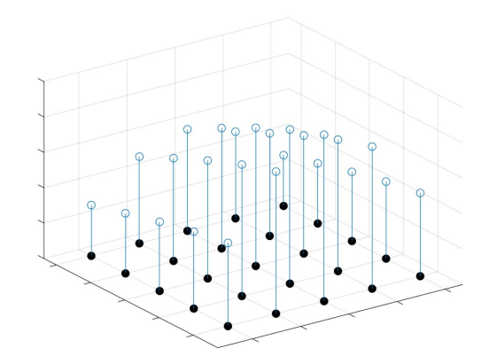
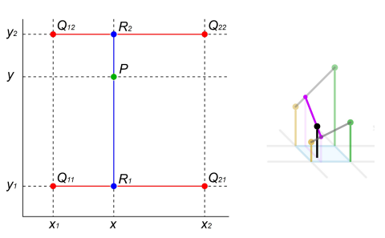
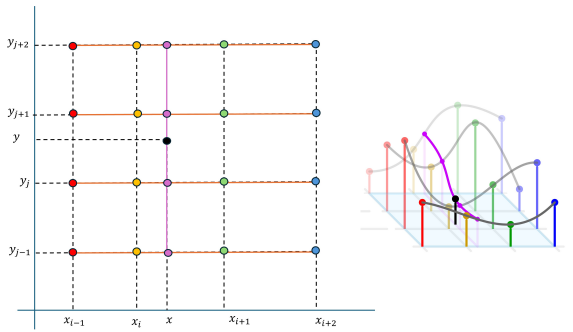

<h1 style="color: red;">Interpolazione di dati e funzioni</h1>

**Definizione:** Siano $(x_i,y_i)$, $i=0,\ldots,n$ punti fissati nel piano cartesiano, con $x_i\in[a,b]$. Il problema dell'interpolazione consiste nel **costruire una funzione $g:[a,b]\to\mathbb{R}$ il cui grafico passa per i punti dati**, ossia che soddisfa le **condizioni di interpolazione**:
$$g(x_i)=y_i,\quad i=0,\ldots,n$$

La funzione $g$ si dice **funzione interpolante** rispetto ai punti di interpolazione $(x_i,y_i)$.
Le ascisse dei punti di interpolazione $x_i$ si chiamano **nodi**.
Quando le ordinate dei punti di interpolazione sono le immagini dei nodi tramite una funzione $f:[a,b]\to\mathbb{R}$, allora si dice che $g$ **interpola la funzione $f$**.

* Fissati i punti da interpolare, esistono infinite funzioni interpolanti.
* Per avere l'unicità della soluzione del problema dell'interpolazione occorre *restringere la classe di funzioni interpolanti*.

| Dati input | Output | Scopo |
| --- | --- | --- |
| $(x_i,y_i)$, $i=0,\ldots,n$ | $g:[a,b]\to\mathbb{R}$ con $g(x_i)=y_i$ | $(x_*,g(x_*))$ con $x_*\in[a,b]$ |

### Interpolazione polinomiale
Le funzioni che useremo per interpolare i nodi sono dei polinomi.

> **Definizione:** I polinomi sono funzioni reali di variabile reale la cui espressione analitica si può scrivere come una *combinazione lineare dei monomi* (ossia le funzioni $1,x,x^2,\ldots$).
> Un polinomio di grado $n$ si scrive come: $$ p_n(x) = a_0 + a_1 x + a_2 x^2 + \ldots +a_nx^n $$ 
> dove $a_0,\ldots,a_n$ sono numeri reali chiamati coefficienti.

> <h2 style="color: red;">Teorema fondamentale dell'algebra</h2>
>
> Dati $n+1$ punti del piano $(x_i,y_i)$, $i=0,\ldots,n$, esiste un unico polinomio di grado al più $n$, denotato con $p_n(x)$, che li interpola, ossia tale che: $$p_n(x_i)=y_i,\quad i=0,\ldots,n$$ 
> Il polinomio $p_n(x)$ viene detto **polinomio di interpolazione** dei punti dati.

Fissati i punti da interpolare, scegliendo il grado del polinomio come il numero dei punti meno uno, il problema dell'interpolazione ha un'unica soluzione.

**Calcolo del polinomio di interpolazione:**
Dal punto di vista numerico "calcolare" il polinomio di interpolazione significa *progettare un algoritmo* che, dati in input i punti $(x_i,y_i)$ e un punto $\bar{x}\in\mathbb{R}$, restituisca in output il valore $p_n(\bar{x})$. A seconda di come si rappresenta il polinomio, ci sono diverse possibilità.

---

<h3 style="color: red;">1. Rappresentazione in forma canonica (Metodo dei coefficienti indeterminati)</h3>

Le **condizioni di interpolazione** si traducono in un sistema lineare di $n+1$ equazioni in $n+1$ incognite, che sono i coefficienti del polinomio. In forma matriciale: $$ V \alpha = y $$ 
dove:
$$V=\underbrace{\begin{bmatrix}1&x_0&x_0^2&\ldots&x_0^n\\1&x_1&x_1^2&\ldots&x_1^n\\\vdots&\vdots&\vdots&\ddots&\vdots\\1&x_n&x_n^2&\ldots&x_n^n\end{bmatrix}}_{\text{matrice di Vandermonde}},\quad\alpha=\underbrace{\begin{bmatrix}a_0\\a_1\\\vdots\\a_n\end{bmatrix}}_{\text{incognite}},\quad y=\underbrace{\begin{bmatrix}y_0\\y_1\\\vdots\\y_n\end{bmatrix}}_{\text{termine noto}}$$

* Si dimostra che $det(V)=\prod_{i>j}(x_i-x_j)$. Pertanto, se i nodi $x_i$ sono distinti, $V$ è non singolare e la soluzione è unica.

**Costo computazionale e Proprietà:**
* **Risoluzione:** La soluzione diretta del sistema $V\alpha=y$ ha un costo dell'ordine di $\mathcal{O}(n^3)$ (per la fattorizzazione di $V$).
* **Valutazione:** Una volta calcolati i coefficienti, per calcolare $p_n(\bar{x})$ l'algoritmo più efficiente è il **metodo di Horner**, che richiede $n$ prodotti e somme floating point. *(Nota: in Python si usa `numpy.polyval` (prende in input i coefficienti del polinomio e restituisce il valore del polinomio in un punto))*.
* **Vantaggi:** I coefficienti non dipendono dal punto $\bar{x}$; si possono riutilizzare per valutare il polinomio in più punti.
* **Svantaggi:** La matrice di Vandermonde è, in generale, malcondizionata, rendendo il metodo numericamente instabile per $n$ elevati.

---

<h3 style="color: red;">2. Rappresentazione nella forma di Lagrange</h3>

In alternativa alla forma canonica, si può scrivere il polinomio interpolante come combinazione lineare di una base dipendente dai nodi, detta **base di Lagrange**.
$$p_n(x)=y_0L_0(x)+y_1L_1(x)+\ldots+y_nL_n(x)$$

I termini $L_k(x)$ sono $n+1$ polinomi di grado $n$ che si annullano in tutti i punti di interpolazione tranne uno, nel quale valgono $1$:
$$L_k(x_j)=\begin{cases}1&\text{se }k=j\\0&\text{se }k\neq j\end{cases}$$

La forma esplicita è:
$$L_k(x)=\prod_{i=0,i\neq k}^n\frac{x-x_i}{x_k-x_i}$$

* **Indipendenza lineare:** Si dimostra che la base di Lagrange è un insieme linearmente indipendente. Ponendo una combinazione lineare uguale a zero e valutandola nei nodi $x_k$, i coefficienti si annullano banalmente.

**Calcolo e Costo Computazionale:**
La parte computazionalmente più costosa è la valutazione della base di Lagrange in $\bar{x}$. Per evitare di ripetere operazioni al numeratore, si calcola inizialmente $\omega_n(\bar{x})=(\bar{x}-x_0)\cdots(\bar{x}-x_n)$.
Di conseguenza:
$$L_k(\bar{x})=\frac{\omega_n(\bar{x})}{(\bar{x}-x_k)\prod_{i=0,i\neq k}(x_k-x_i)}$$
* **Costo:** L'algoritmo richiede $n^2+n$ prodotti e $n$ divisioni, riducendo la complessità a $\mathcal{O}(n^2)$ rispetto alla forma canonica.
* **Svantaggio principale:** Nel caso in cui si voglia aggiungere un nuovo punto di interpolazione (aumentando il grado del polinomio), occorre ricalcolare da zero **tutta** la base di Lagrange.

---

<h3 style="color: red;">Norme di funzioni ed Errore di Interpolazione</h3>

**Norme di funzioni:** Il concetto di "somiglianza" o distanza tra funzioni è quantificato matematicamente dalla norma.
Sia $f:[a,b]\to\mathbb{R}$ continua. La **norma infinito** di $f$ è definita come:
$$\|f\|_\infty=\max_{x\in[a,b]}|f(x)|$$
Se $\|f-g\|_\infty<\epsilon$, significa che il grafico di $g$ si trova in un 'canale' di raggio $\epsilon$ centrato perfettamente sul grafico di $f$.

**Errore (o resto) di interpolazione:**
* Obbiettivo: studiare la funzione resto $R_n(x)=f(x)-p_n(x)$ per stabilire sotto quali condizioni $p_n(x)$ è una buona approssimazione di $f(x)$ nell'intervallo $[a,b]$.

> **Teorema**
> Sia $f\in C^{n+1}([a,b])$, con $x_i\in[a,b]$, $i=0,\ldots,n$ e sia $p_n(x)$ il polinomio di interpolazione. Allora l'errore commesso in un punto $x$ è valutabile come:
> $$R_n(x)=\frac{\omega_{x_0,\ldots,x_n}(x)}{(n+1)!}f^{(n+1)}(\xi)$$
> dove $\xi\in[a,b]$ e $\omega_{x_0,\ldots,x_n}(x)=(x-x_0)(x-x_1)\cdots(x-x_n)$.

Dato che derivata e $\omega$ sono funzioni continue nel chiuso limitato $[a,b]$, ammettono massimo. Definendo $M_{n+1}^f=\max|f^{(n+1)}(x)|$ e $\omega^*_{x_0,\ldots,x_n}=\max|\omega_{x_0,\ldots,x_n}(x)|$, otteniamo la stima:
$$|R_n(x)|\leq\frac{M_{n+1}^f\cdot\omega^*_{x_0,\ldots,x_n}}{(n+1)!}\quad\forall x\in[a,b]$$

**Fattori che influiscono sull'errore**:
1. **Il numero dei punti da interpolare:** Apparentemente l'errore cala al crescere di $n$ a causa del $(n+1)!$ al denominatore.
2. **La distribuzione dei punti da interpolare:** Il termine $\omega^*$ dipende direttamente dalla posizione dei nodi $x_0,\ldots,x_n$.

---

<h3 style="color: red;">Fenomeno di Runge e Nodi di Chebyshev</h3>

**Il Fenomeno di Runge:**
L'intuizione suggerirebbe che aumentare i punti produca approssimazioni migliori, ma questo è **falso** se non si bilancia la loro distribuzione. 
Questo è dimostrato interpolando la funzione di Runge $f(x)=\frac{1}{1+25x^2}$ su intervallo $[-1,1]$. Se si estraggono $n$ nodi **equispaziati**, la derivata $(n+1)$-esima cresce più rapidamente di quanto il fattoriale al denominatore possa compensare. L'effetto visivo (e numerico) è che il polinomio esibisce oscillazioni mostruose e incontrollate in prossimità degli estremi dell'intervallo.

**La soluzione: Nodi di Chebyshev:**
Per debellare il fenomeno di Runge serve una distribuzione di nodi più densa verso gli estremi dell'intervallo (dove le oscillazioni premono per esplodere).
I **nodi di Chebyshev** fanno proprio questo: si ottengono partizionando uniformemente la semicirconferenza goniometrica e proiettandone i punti sul diametro. Analiticamente:
$$x_i=\cos\left(\frac{(2i+1)\pi}{2(n+1)}\right),\quad i=0,\ldots,n$$

**Proprietà fondamentali dei nodi di Chebyshev:**
1. **Traslabilità:** Possono essere adattati as un qualsiasi intervallo $[a,b]$ mantenendo intatte le loro proprietà tramite la mappa $\mu(x)=\frac{b-a}{2}x+\frac{a+b}{2}$.
2. **Proprietà Min-Max:** I nodi di Chebyshev garantiscono che il massimo del termine polinomiale dell'errore, ovvero $\omega^*_{x_0,\ldots,x_n}=\max_{x\in[a,b]}|(x-x_0)\cdots(x-x_n)|$, sia **minimo** rispetto a qualsiasi altra scelta di nodi.
3. **Controllo dell'Errore:** Grazie a questa configurazione geometrica si dimostra che:
$$\omega^*_{x_0,\ldots,x_n}=2\left(\frac{b-a}{4}\right)^{n+1}$$
In questo modo le oscillazioni si smorzano e l'interpolazione diventa convergente per ogni funzione regolare.

### Svantaggi del polinomio di interpolazione:
1. Il polinomio di interpolazione dipende e si costruisce solo se TUTTI i punti di interpolazione sono **noti a priori**.
2. Se si hanno a disposizione molti punti, si ottiene un polinomio di grado molto elevato (grado $n$, numero di punti $n+1$) che, oltre a essere computazionalmente costoso, è anche numericamente instabile (fenomeno di Runge).

<h1 style="color: red;">Interpolazione polinomiale a tratti</h1>

Invece di costruire un'unica funzione interpolante che sia globalmente un polinomio definito su tutto l'intervallo $[a,b]$, si considerano **funzioni polinomiali a tratti**, che sono polinomi di un grado fissato se ristrette a ciascun sottointervallo $[x_{i}, x_{i+1}]$ di una partizione di $[a,b]$.  
Il caso più semplice è quello delle *funzioni lineari a tratti*, ovvero polinomi di grado $1$ su ciascun sottointervallo (spezzate di $n - 1$ segmenti), dove $n$ è il numero dei nodi da interpolare.

Esempio pratico: costruiamo la seguente *funzione interpolante lineare a tratti* per una quantità di punti di interpolazione $(x_i, y_i), i=0,\ldots,m+1$ pari a $m + 2$.  
Costruiamo dunque la funzione $s(x)$ che interpola i punti dati come segue:
$$s(x) = \underbrace{y_i + \frac{y_{i+1} - y_i}{x_{i+1} - x_i}(x - x_i)}_{s_i(x)},\quad x\in[x_i, x_{i+1}],\quad i=0,\ldots,m$$

<h3 style="color: red;">Errore nell'interpolazione lineare a tratti</h3>

Supponiamo che le ordinate dei punti dati corrispondano ai valori esatti assunti da una funzione ignota nei nodi, ovvero $y_i = f(x_i)$ per $i=0,\ldots,m+1$. 

* **Obiettivo:** Vogliamo studiare le proprietà e il comportamento della funzione resto globale, definita come $R^s(x) = f(x) - s(x)$.
* **Ipotesi:** Assumiamo che la funzione originale $f$ sia sufficientemente regolare nell'intervallo di interesse, nello specifico che sia derivabile due volte con continuità: $f \in C^2([x_0, x_{m+1}])$.

Per analizzare il comportamento del resto $R^s(x)$, conviene scomporre il problema e restringersi a un singolo sottointervallo $[x_i, x_{i+1}]$ per $i=0,\ldots,m$. In ciascun sottointervallo, la funzione globale $s(x)$ coincide con il singolo segmento lineare $s_i(x)$, che equivale a un polinomio di interpolazione di grado $n=1$. Possiamo quindi applicare localmente il teorema del resto del polinomio di interpolazione:

$$f(x) - s_i(x) = \frac{f''(\xi_i)}{2}(x - x_i)(x - x_{i+1}), \quad \text{con } \xi_i \in [x_i, x_{i+1}], \quad \forall x \in [x_i, x_{i+1}]$$

Se assumiamo che il modulo della derivata seconda di $f$ sia limitato superiormente da una costante in tutto il dominio, ovvero $|f''(x)| \le M_2^f$ per ogni $x \in [x_0, x_{m+1}]$, possiamo maggiorare l'errore locale come segue:

$$|f(x) - s_i(x)| \le \frac{M_2^f}{2} \max_{x \in [x_i, x_{i+1}]} |(x - x_i)(x - x_{i+1})|, \quad \forall x \in [x_i, x_{i+1}]$$

Studiamo adesso il termine di destra legato alla distribuzione dei nodi nell'intervallo $[x_i, x_{i+1}]$:
Poiché ci troviamo all'interno del sottointervallo, la quantità in modulo può essere riscritta eliminando il valore assoluto nella parabola concava $(x - x_i)(x_{i+1} - x)$. Trattandosi di una parabola con concavità rivolta verso il basso e zeri nei nodi $x_i$ e $x_{i+1}$, il suo punto di massimo assoluto si colloca esattamente nel punto medio del sottointervallo, ossia per $x = \frac{x_i + x_{i+1}}{2}$. 

Sostituendo questo punto di massimo all'interno della relazione, otteniamo:
$$\max_{x \in [x_i, x_{i+1}]} |(x - x_i)(x - x_{i+1})| = \frac{(x_{i+1} - x_i)^2}{4}$$

Mettendo insieme i due passaggi (il $2$ al denominatore derivante dal fattoriale e il $4$ ottenuto dal massimo della parabola), l'errore sul singolo sottointervallo risulta limitato da:
$$|f(x) - s_i(x)| \le \frac{M_2^f}{8}(x_{i+1} - x_i)^2, \quad \forall x \in [x_i, x_{i+1}]$$

<h3 style="color: red;">Teorema di Maggiorazione Globale</h3>

Per estendere la stima locale a livello globale su tutto l'intervallo $[a, b]$, introduciamo il parametro $h$, che rappresenta l'ampiezza massima tra tutti i sottointervalli che compongono la partizione: $$ h = \max_{i \in \{0, \ldots, m\}} (x_{i+1} - x_i) $$ 

Maggiorando l'ampiezza di ogni singolo sottointervallo con il suo valore massimo possibile $h$, si formula il seguente teorema fondamentale per la stima dell'errore:

> **Teorema:** Sia $f \in C^2([a,b])$ e siano $x_0, \ldots, x_{m+1} \in [a,b]$. Indichiamo con $M_2^f$ il massimo di $|f''(y)|$ nell'intervallo $[a, b]$ e con $h = \max_{i} (x_{i+1} - x_i)$. Se $s(x)$ è la funzione interpolante lineare a tratti tale che $s(x_i) = f(x_i)$ per $i=0, \ldots, m+1$, allora si ha: $$\|f - s\|_\infty \le \frac{M_2^f}{8} h^2$$ 

<h3 style="color: red;">Osservazioni e Proprietà</h3>

* **Caso particolare (Partizione Uniforme):** Se l'intervallo $[a, b]$ viene suddiviso mediante una partizione uniforme (sottointervalli tutti della stessa ampiezza), i nodi si distribuiscono secondo la legge $x_i = a + i \frac{(b-a)}{m+1}$ per $i=0, \ldots, m+1$. In questo caso, l'ampiezza massima coincide esattamente con la larghezza fissa del singolo sottointervallo $h = \frac{b-a}{m+1}$. Sostituendo questo termine all'interno della tesi del teorema si ricava:
  $$\|f - s\|_\infty \le \frac{M_2^f (b-a)^2}{8} \frac{1}{(m+1)^2}$$
* **Assenza del Fenomeno di Runge:** Dalla relazione precedente emerge una proprietà cruciale: all'aumentare del numero di sottointervalli (ovvero al crescere di $m$), l'errore commesso decresce in modo stabile e proporzionale a $\frac{1}{(m+1)^2}$. Di conseguenza, l'errore decade verso lo zero e con l'interpolazione a tratti **NON si verifica il fenomeno di Runge**, garantendo la convergenza dell'approssimazione.
* **Vantaggi dell'interpolazione lineare a tratti:** Semplicità di implementazione, stabilità numerica e assenza di oscillazioni incontrollate (non è soggetta al fenomeno di Runge) sono i principali punti di forza di questo approccio. Inoltre, la costruzione locale su ciascun sottointervallo consente di gestire facilmente l'aggiunta o la rimozione di nodi senza dover ricalcolare l'intera funzione interpolante.
* **Svantaggi dell'interpolazione lineare a tratti:** Il principale limite di questo approccio risiede nella perdita di regolarità della funzione approssimante. La spezzata $s(x)$ è una funzione globale continua, ma presenta punti angolosi ("spigoli") in corrispondenza di ciascun nodo interno $x_i$, il che significa che **non è derivabile** in tali punti. In questo modo viene sacrificata una caratteristica geometrica importante della funzione originale $f$.

*Nota metodologica: Al fine di superare questo svantaggio e definire funzioni a tratti che siano al contempo stabili (prive dell'effetto Runge) e ad alta regolarità geometrica (prive di spigoli e completamente derivabili nei nodi), si introduce lo spazio delle **funzioni spline**.*

<h1 style="color: red;">Le funzioni spline</h1>

> **Definizione:** Sia $[a,b]$ un intervallo e $x_0, \ldots, x_{m+1}$ una partizione di esso tale che $x_0 = a$ e $x_{m+1} = b$.   Si definisce **spline di grado $n$** relativa alla partizione $x_0, \ldots, x_{m+1}$ una funzione $s(x)$ che soddisfa le seguenti due condizioni:
> 1. Ristretta a ciascun sottointervallo $[x_i, x_{i+1}]$, la funzione coincide con un polinomio $s_i(x)$ di grado al più $n$ (per ogni $i=0, \ldots, m$).
> 2. La funzione $s$ e tutte le sue derivate fino all'ordine $n-1$ sono continue su tutto l'intervallo $[a,b]$. In gergo matematico: $$s \in C^{n-1}([a,b])$$

- Ristretta al singolo intervallo, la regolarità $C^{n-1}$ è garantita banalmente dal fatto che $s_i(x)$ è un polinomio.
- Il vero vincolo della seconda condizione è sui **nodi interni** (i punti di "saldatura" tra un polinomio e l'altro). Richiede che i polinomi adiacenti abbiano lo stesso valore e le stesse derivate nel punto in comune:
  $$s_i^{(k)}(x_{i+1}) = s_{i+1}^{(k)}(x_{i+1}), \quad k=0, \ldots, n-1, \quad i=0, \ldots, m-1$$

### Osservazioni:
- Le funzioni lineari a tratti viste in precedenza sono un *caso particolare* della definizione di spline con $n = 1$ e si dicono **spline lineari**.
- Il caso di gran lunga più importante è quello delle **spline cubiche** ($n = 3$). In questo caso, la funzione $s(x)$ è garanzia di un'elevatissima regolarità geometrica: è continua, derivabile e con derivata seconda continua su tutto l'intervallo. Le **condizioni di regolarità** nei nodi diventano:
  $$s_i(x_{i+1}) = s_{i+1}(x_{i+1}), \quad s_i'(x_{i+1}) = s_{i+1}'(x_{i+1}), \quad s_i''(x_{i+1}) = s_{i+1}''(x_{i+1})$$

---

<h3 style="color: red;">Dimensioni dello spazio (Gradi di libertà)</h3>

Per capire come costruire una spline, dobbiamo prima contare quanti parametri (gradi di libertà) ci servono per descriverla su una partizione di $m+2$ punti.

- Ogni 'pezzo' $s_i(x)$ è un polinomio di grado $n$, quindi possiede $n+1$ coefficienti.
- Essendoci in totale $m+1$ 'pezzi' di spline, il numero totale di parametri da calcolare è **$(m+1)(n+1)$**.
- Tuttavia, i pezzi non sono indipendenti! Le condizioni di regolarità impongono che per ogni nodo interno (che sono $m$) debbano coincidere $n$ valori (funzione e $n-1$ derivate). Questo "brucia" $nm$ parametri.

> **Gradi di libertà delle spline di grado $n$:**
> I parametri liberi effettivi di una spline sono dati dalla differenza tra incognite totali e vincoli di continuità:
> $$(n+1)(m+1) - nm = n+m+1$$

<h3 style="color: red;">Spline di interpolazione</h3>

Il nostro obiettivo è utilizzare le spline per interpolare i dati. Imponiamo quindi le **condizioni di interpolazione** per costringere la spline a passare per i nodi: $$ s(x_i) = y_i, \quad i=0, \ldots, m+1 $$

Queste equazioni sono $m+2$ in totale. Se le sottraiamo ai gradi di libertà appena calcolati, otteniamo i gradi di libertà residui:
$$(n+m+1) - (m+2) = n - 1$$

> **Conclusione fondamentale:** Eccetto il caso lineare ($n=1$ in cui i gradi di libertà residui sono zero e la spezzata è unica), **non c'è un'unica spline di interpolazione**. Fissati i punti, esistono infinite spline di grado $n>1$ che li interpolano, che variano in base ai parametri liberi rimasti. Per le spline cubiche ($n=3$) restano sempre **2 parametri liberi**.

---

<h3 style="color: red;">Costruzione delle spline cubiche di interpolazione</h3>

Vogliamo costruire gli $m+1$ polinomi di grado 3 del tipo:
$$s_i(x) = \alpha_i + \beta_i (x - x_i) + \gamma_i (x - x_i)^2 + \delta_i (x - x_i)^3$$
Calcolare la spline significa trovare le incognite $\alpha_i, \beta_i, \gamma_i, \delta_i$ partendo dai dati $(x_i, y_i)$. 

**L'idea concettuale dietro la risoluzione:**
Invece di risolvere un sistema gigante ed esplosivo, il problema si semplifica matematicamente notando che $\alpha_i$ corrisponde banalmente al dato di interpolazione $y_i$. Sfruttando le condizioni di continuità ($s=s, s'=s', s''=s''$), si riescono a scrivere i coefficienti $\gamma_i$ e $\delta_i$ in funzione solo delle derivate prime $\beta_i$. 
Tutto si riduce alla costruzione di un **sistema lineare di equazioni in cui le uniche vere incognite sono i coefficienti $\beta$** (che rappresentano le pendenze della spline nei nodi).

Questo sistema si presenta nella forma matriciale $Tz = c$ dove la matrice dei coefficienti $T$ risulta **strettamente diagonale dominante per righe**. Questo è un risultato vitale dal punto di vista dell'analisi numerica: assicura che il sistema ha sempre un'unica soluzione calcolabile in modo stabile!

---

<h3 style="color: red;">Risoluzione dei 2 gradi di libertà (Tipi di Spline)</h3>

Abbiamo visto che per la spline cubica avanzano 2 gradi di libertà. Per ottenere un'unica spline definitiva dobbiamo imporre **due condizioni aggiuntive** agli estremi dell'intervallo $[x_0, x_{m+1}]$. In base alla scelta che facciamo, otteniamo tipi diversi di spline:

1. **Spline Cubica Vincolata (Clamped):** Si impone il valore esatto delle derivate prime (le pendenze) agli estremi dell'intervallo: $s'(x_0) = \beta_0$ e $s'(x_{m+1}) = \beta_{m+1}$.
2. **Spline Cubica Naturale:** Si assume che la curvatura agli estremi sia nulla, azzerando le derivate seconde: $s''(x_0) = 0$ e $s''(x_{m+1}) = 0$.
3. **Spline Cubica Periodica:** Si usa per funzioni chiuse o periodiche (dove $y_0 = y_{m+1}$), imponendo che la spline si "chiuda dolcemente" su se stessa: $s'(x_0) = s'(x_{m+1})$ e $s''(x_0) = s''(x_{m+1})$.
4. **Spline Not-a-knot (Matlab):** Si forza il primo e il secondo pezzo ($s_0$ e $s_1$) ad essere lo stesso identico polinomio cubico, e lo stesso vale per gli ultimi due. Di fatto, si rimuove un nodo come punto di giunzione reale.

---

<h3 style="color: red;">Proprietà e Teoremi delle Spline Cubiche</h3>

> **Teorema della Minima Curvatura**
> Tra tutte le infinite funzioni "lisce" ($f \in C^2$) che interpolano gli stessi punti dati, la spline cubica (vincolata, naturale o periodica) è quella che soddisfa la proprietà di minimo:
> $$\int_a^b (s''(x))^2 dx \le \int_a^b (f''(x))^2 dx$$
> *Significato fisico:* Le spline cubiche sono le curve che si flettono il meno possibile. Presentano le curve più 'dolci' ed evitano sbalzi di pendenza o repentine oscillazioni, simulando il comportamento di un vero listello elastico vincolato fisicamente.

> **Teorema sull'Errore di Interpolazione**
> Data la funzione originale $f \in C^2$ e chiamata $h$ l'ampiezza massima degli intervalli tra i nodi, l'errore commesso dalla spline cubica è limitato da:
> $$|f(x) - s(x)| \le h^{\frac{3}{2}} \left( \int_a^b (f''(x))^2 dx \right)^{\frac{1}{2}}$$
> Inoltre la derivata della spline approssima bene anche la derivata della funzione originaria:
> $$|f'(x) - s'(x)| \le h^{\frac{1}{2}} \left( \int_a^b (f''(x))^2 dx \right)^{\frac{1}{2}}$$

**Conseguenze dell'errore:** Le spline cubiche garantiscono un'accuratezza altissima che **migliora sempre** al diminuire della distanza $h$ tra i nodi. A differenza dei polinomi di grado elevato, con l'uso delle spline **non si verifica mai il fenomeno di Runge**.

<h1 style="color: red;">Interpolazione 2D</h1>

Dati $(x_i,y_j)\in\mathbb{R}^2$ e $z_{ij}\in\mathbb{R}$, con $i=1,\ldots,n$ e $j=1,\ldots,m$, vogliamo costruire una funzione $g:\mathbb{R}^2\to\mathbb{R}$ che interpoli i punti dati, ossia tale che:
$$g(x_i,y_j)=z_{ij},\quad i=1,\ldots,n,\quad j=1,\ldots,m$$

---

## Interpolazione bilineare

Se $(x,y)$ è tale che $x\in[x_i,x_{i+1}]$ e $y\in[y_j,y_{j+1}]$, l'interpolante bilineare in $(x,y)$ si calcola con i seguenti tre passi:

1. $$g(x,y_j)=g(x_i,y_j)+\frac{g(x_{i+1},y_j)-g(x_i,y_j)}{x_{i+1}-x_i}(x-x_i)$$
2. $$g(x,y_{j+1})=g(x_i,y_{j+1})+\frac{g(x_{i+1},y_{j+1})-g(x_i,y_{j+1})}{x_{i+1}-x_i}(x-x_i)$$
3. $$g(x,y)=g(x,y_j)+\frac{g(x,y_{j+1})-g(x,y_j)}{y_{j+1}-y_j}(y-y_j)$$

### Guida alla Lettura del Grafico: Interpolazione Bilineare

Il grafico a sinistra illustra visivamente come trovare il valore del **punto verde $P$** alle coordinate $(x,y)$, partendo dai quattro **punti rossi $Q$** agli angoli del rettangolo (i nostri valori noti). 

L'operazione si definisce "bilineare" perché, invece di usare una complessa formula 2D, divide il problema in **tre semplici interpolazioni lineari** (tracciando linee rette): due volte lungo la direzione $x$ e una volta lungo la direzione $y$.

* **Passo 1 (Lato inferiore):** Si traccia un segmento tra i due punti rossi in basso, $Q_{11}$ e $Q_{21}$. Calcolando il valore in corrispondenza della coordinata $x$, si trova il primo **punto blu $R_1$**.
* **Passo 2 (Lato superiore):** Si fa la stessa cosa sul segmento in alto, tra i punti rossi $Q_{12}$ e $Q_{22}$. Calcolando il valore alla stessa coordinata $x$, si trova il secondo **punto blu $R_2$**.
* **Passo 3 (Asse verticale):** I punti rossi ora non servono più. Si traccia un segmento verticale tra i due nuovi punti blu $R_1$ e $R_2$. Calcolando il valore all'altezza $y$ su questo segmento, si ottiene finalmente il **punto verde $P$**.

> **Cosa rappresenta il grafico 3D a destra?** > Mostra le altezze reali (il valore della funzione, o asse $z$) dei punti. Le aste esterne sono i quattro angoli noti. Questa tecnica crea di fatto una superficie curva (a "sella") tesa tra quei quattro angoli, e l'asta nera centrale rappresenta l'altezza esatta del punto $P$ calcolata sulla base degli angoli circostanti.

### Formulazione come Combinazione Lineare (Somma Pesata)

La formula per calcolare l'interpolante bilineare può essere riscritta in modo più compatto come una **somma pesata** dei quattro valori noti ai vertici:
$$g(x,y)=w_{ij}g(x_i,y_j)+w_{i,j+1}g(x_i,y_{j+1})+w_{i+1,j}g(x_{i+1},y_j)+w_{i+1,j+1}g(x_{i+1},y_{j+1})$$

I "pesi" $w$ dipendono esclusivamente dalla geometria del rettangolo e dalla distanza del punto $(x,y)$ dai vertici:
* $w_{ij}=\frac{(x_{i+1}-x)(y_{j+1}-y)}{(x_{i+1}-x_i)(y_{j+1}-y_j)}$
* $w_{i+1,j}=\frac{(x-x_i)(y_{j+1}-y)}{(x_{i+1}-x_i)(y_{j+1}-y_j)}$
* $w_{i,j+1}=\frac{(x_{i+1}-x)(y-y_j)}{(x_{i+1}-x_i)(y_{j+1}-y_j)}$
* $w_{i+1,j+1}=\frac{(x-x_i)(y-y_j)}{(x_{i+1}-x_i)(y_{j+1}-y_j)}$

**Caso speciale: Griglia Uniforme su un raffinamento**
Se assumiamo che la griglia dei nodi sia perfettamente equispaziata ($\Delta_x = x_{i+1}-x_i$ e $\Delta_y = y_{j+1}-y_j$) e vogliamo calcolare il punto esattamente al centro, le formule collassano in un calcolo elementare. Ad esempio, fissando per semplicità $\Delta_x=\Delta_y=2$, tutti e quattro i pesi diventano uguali a $\frac{1}{4}$. L'interpolazione si riduce alla media aritmetica dei quattro vertici:
$$g(x,y)=\frac{1}{4}(g(x_i,y_j)+g(x_i,y_{j+1})+g(x_{i+1},y_j)+g(x_{i+1},y_{j+1}))$$

---

## Interpolazione bicubica e Spline 2D

*Nota generale: Con lo stesso principio visto per l'interpolazione bilineare (scomporre il problema 2D in una sequenza di problemi 1D), si possono ottenere le versioni bidimensionali di tutte le tecniche di interpolazione 1D*.

Se $(x,y)$ è tale che $x\in[x_i,x_{i+1}]$ e $y\in[y_j,y_{j+1}]$, l'interpolante bicubica in $(x,y)$ si calcola con i seguenti passi:

1. Calcolare $g(x,y_{j-1})$ valutando il polinomio cubico che interpola $(x_{i-1},y_{j-1}),(x_i,y_{j-1}),(x_{i+1},y_{j-1}),(x_{i+2},y_{j-1})$
2. Calcolare $g(x,y_j)$ valutando il polinomio cubico che interpola $(x_{i-1},y_j),(x_i,y_j),(x_{i+1},y_j),(x_{i+2},y_j)$
3. Calcolare $g(x,y_{j+1})$ valutando il polinomio cubico che interpola $(x_{i-1},y_{j+1}),(x_i,y_{j+1}),(x_{i+1},y_{j+1}),(x_{i+2},y_{j+1})$
4. Calcolare $g(x,y_{j+2})$ valutando il polinomio cubico che interpola $(x_{i-1},y_{j+2}),(x_i,y_{j+2}),(x_{i+1},y_{j+2}),(x_{i+2},y_{j+2})$
5. Infine, calcolare $g(x,y)$ valutando il polinomio cubico che interpola i quattro risultati appena trovati: $(x,g(x,y_{j-1})),(x,g(x,y_j)),(x,g(x,y_{j+1})),(x,g(x,y_{j+2}))$

### Guida alla Lettura del Grafico: Interpolazione Bicubica

Il grafico a sinistra mostra come il punto da calcolare (il **pallino nero**) non dipenda solo dal quadrato in cui si trova, ma da una "finestra" più ampia di **16 punti noti** (disposti su 4 righe e 4 colonne).

L'interpolazione avviene scomponendo il processo in **cinque interpolazioni monodimensionali tramite curve (polinomi cubici)**:

* **Passi 1-4 (Linee orizzontali):** Per ciascuna delle 4 righe orizzontali ($y_{j-1}, y_j, y_{j+1}, y_{j+2}$), si prende il gruppo di 4 punti noti e ci si fa passare una curva cubica. Su ognuna di queste 4 curve, si calcola il valore esatto alla coordinata $x$ desiderata. Questo ci fornisce **4 nuovi punti intermedi** (rappresentati dai **pallini viola** allineati verticalmente).
* **Passo 5 (Curva verticale):** Ora si ignorano i 16 punti originali. Si prende una nuova curva cubica e la si fa passare attraverso i 4 pallini viola appena calcolati. Calcolando il valore di questa curva all'altezza $y$, si ottiene finalmente il **pallino nero** (il nostro $g(x,y)$ finale).

> **Cosa rappresenta il grafico 3D a destra?** > Mostra la superficie generata. A differenza dell'interpolazione bilineare (che crea superfici con "spigoli" o pieghe visibili in corrispondenza dei punti noti), l'uso di polinomi cubici genera una superficie **estremamente liscia e continua**, senza interruzioni brusche nella pendenza.

### Interpolazione Spline 2D
Un'alternativa ancora più regolare rispetto ai semplici polinomi bicubici è l'**interpolazione spline 2D**. Si costruisce con una logica del tutto analoga all'interpolante bicubica (incrociando le direzioni $x$ e $y$), ma utilizzando le *spline cubiche 1D* lungo le due direzioni. Questo garantisce che non solo la funzione sia continua, ma che lo siano anche le sue derivate prime e seconde sull'intera griglia!

---

## Applicazioni Pratiche

L'interpolazione 2D trova largo impiego in informatica, specialmente nell'elaborazione di immagini digitali (dove i nodi sono i pixel):
* **Ingrandimento di immagini (Upscaling):** Quando un'immagine viene ingrandita, il software deve "inventare" i pixel mancanti interpolando i colori di quelli noti adiacenti.
* **Image Inpainting:** Tecniche di restauro digitale in cui si ricostruiscono parti danneggiate o mancanti di un'immagine interpolando le informazioni dal contorno sano. 

---

Note (implementazione in Python):

| | `numpy.polyfit` | `numpy.polyval` |
|---|---|---|
| Input | $x_i$, $y_i$, grado del polinomio | Coefficienti del polinomio, punto di valutazione $\bar{x}$ |
| Output | Coefficienti del polinomio di interpolazione | Valore del polinomio in $\bar{x}$ |

Per creare le spline cubiche in SciPy si utilizza la funzione `scipy.interpolate.CubicSpline` che accetta i nodi $x_i$, i valori $y_i$ e il tipo di spline desiderato (vincolata, naturale, periodica). La valutazione della spline in un punto $\bar{x}$ avviene semplicemente chiamando l'oggetto spline come una funzione: `spline(𝑥̄)`.