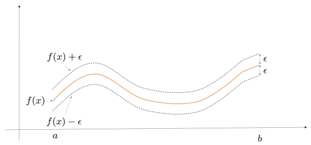
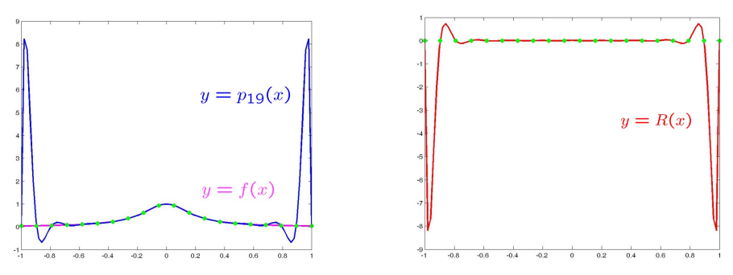
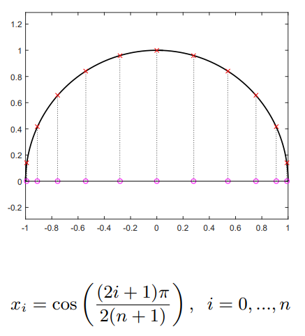
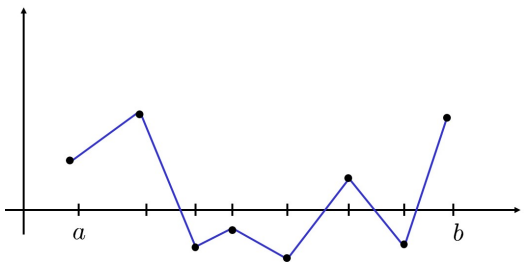
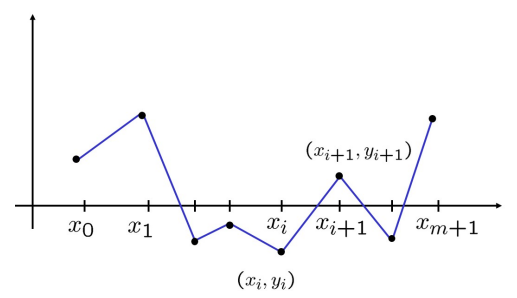

<h1 style="color: red;">Interpolazione di dati e funzioni</h1>

**Definizione:** Siano $(x_i,y_i)$, $i=0,\ldots,n$ punti fissati nel piano cartesiano, con $x_i\in[a,b]$. Il problema dell'interpolazione consiste nel **costruire una funzione $g:[a,b]\to\mathbb{R}$ il cui grafico passa per i punti dati**, ossia che soddisfa le **condizioni di interpolazione**:
$$g(x_i)=y_i,\quad i=0,\ldots,n$$

La funzione $g$ si dice **funzione interpolante** rispetto ai punti di interpolazione $(x_i,y_i)$.
Le ascisse dei punti di interpolazione $x_i$ si chiamano **nodi**.
Quando le ordinate dei punti di interpolazione sono le immagini dei nodi tramite una funzione $f:[a,b]\to\mathbb{R}$, allora si dice che $g$ **interpola la funzione $f$**.

* Fissati i punti da interpolare, esistono infinite funzioni interpolanti.
* Per avere l'unicità della soluzione del problema dell'interpolazione occorre *restringere la classe di funzioni interpolanti*.

| Dati input | Output | Scopo |
| --- | --- | --- |
| $(x_i,y_i)$, $i=0,\ldots,n$ | $g:[a,b]\to\mathbb{R}$ con $g(x_i)=y_i$ | $(x_*,g(x_*))$ con $x_*\in[a,b]$ |

### Interpolazione polinomiale
Le funzioni che useremo per interpolare i nodi sono dei polinomi.

> **Definizione:** I polinomi sono funzioni reali di variabile reale la cui espressione analitica si può scrivere come una *combinazione lineare dei monomi* (ossia le funzioni $1,x,x^2,\ldots$).
> Un polinomio di grado $n$ si scrive come: $$ p_n(x) = a_0 + a_1 x + a_2 x^2 + \ldots +a_nx^n $$ 
> dove $a_0,\ldots,a_n$ sono numeri reali chiamati coefficienti.

> <h2 style="color: red;">Teorema fondamentale dell'algebra</h2>
>
> Dati $n+1$ punti del piano $(x_i,y_i)$, $i=0,\ldots,n$, esiste un unico polinomio di grado al più $n$, denotato con $p_n(x)$, che li interpola, ossia tale che: $$p_n(x_i)=y_i,\quad i=0,\ldots,n$$ 
> Il polinomio $p_n(x)$ viene detto **polinomio di interpolazione** dei punti dati.

Fissati i punti da interpolare, scegliendo il grado del polinomio come il numero dei punti meno uno, il problema dell'interpolazione ha un'unica soluzione.

**Calcolo del polinomio di interpolazione:**
Dal punto di vista numerico "calcolare" il polinomio di interpolazione significa *progettare un algoritmo* che, dati in input i punti $(x_i,y_i)$ e un punto $\bar{x}\in\mathbb{R}$, restituisca in output il valore $p_n(\bar{x})$. A seconda di come si rappresenta il polinomio, ci sono diverse possibilità.

---

<h3 style="color: red;">1. Rappresentazione in forma canonica (Metodo dei coefficienti indeterminati)</h3>

Le **condizioni di interpolazione** si traducono in un sistema lineare di $n+1$ equazioni in $n+1$ incognite, che sono i coefficienti del polinomio. In forma matriciale: $$ V \alpha = y $$ 
dove:
$$V=\underbrace{\begin{bmatrix}1&x_0&x_0^2&\ldots&x_0^n\\1&x_1&x_1^2&\ldots&x_1^n\\\vdots&\vdots&\vdots&\ddots&\vdots\\1&x_n&x_n^2&\ldots&x_n^n\end{bmatrix}}_{\text{matrice di Vandermonde}},\quad\alpha=\underbrace{\begin{bmatrix}a_0\\a_1\\\vdots\\a_n\end{bmatrix}}_{\text{incognite}},\quad y=\underbrace{\begin{bmatrix}y_0\\y_1\\\vdots\\y_n\end{bmatrix}}_{\text{termine noto}}$$

* Si dimostra che $det(V)=\prod_{i>j}(x_i-x_j)$. Pertanto, se i nodi $x_i$ sono distinti, $V$ è non singolare e la soluzione è unica.

**Costo computazionale e Proprietà:**
* **Risoluzione:** La soluzione diretta del sistema $V\alpha=y$ ha un costo dell'ordine di $\mathcal{O}(n^3)$ (per la fattorizzazione di $V$).
* **Valutazione:** Una volta calcolati i coefficienti, per calcolare $p_n(\bar{x})$ l'algoritmo più efficiente è il **metodo di Horner**, che richiede $n$ prodotti e somme floating point. *(Nota: in Python si usa `numpy.polyval` (prende in input i coefficienti del polinomio e restituisce il valore del polinomio in un punto))*.
* **Vantaggi:** I coefficienti non dipendono dal punto $\bar{x}$; si possono riutilizzare per valutare il polinomio in più punti.
* **Svantaggi:** La matrice di Vandermonde è, in generale, malcondizionata, rendendo il metodo numericamente instabile per $n$ elevati.

---

<h3 style="color: red;">2. Rappresentazione nella forma di Lagrange</h3>

In alternativa alla forma canonica, si può scrivere il polinomio interpolante come combinazione lineare di una base dipendente dai nodi, detta **base di Lagrange**.
$$p_n(x)=y_0L_0(x)+y_1L_1(x)+\ldots+y_nL_n(x)$$

I termini $L_k(x)$ sono $n+1$ polinomi di grado $n$ che si annullano in tutti i punti di interpolazione tranne uno, nel quale valgono $1$:
$$L_k(x_j)=\begin{cases}1&\text{se }k=j\\0&\text{se }k\neq j\end{cases}$$

La forma esplicita è:
$$L_k(x)=\prod_{i=0,i\neq k}^n\frac{x-x_i}{x_k-x_i}$$

* **Indipendenza lineare:** Si dimostra che la base di Lagrange è un insieme linearmente indipendente. Ponendo una combinazione lineare uguale a zero e valutandola nei nodi $x_k$, i coefficienti si annullano banalmente.

**Calcolo e Costo Computazionale:**
La parte computazionalmente più costosa è la valutazione della base di Lagrange in $\bar{x}$. Per evitare di ripetere operazioni al numeratore, si calcola inizialmente $\omega_n(\bar{x})=(\bar{x}-x_0)\cdots(\bar{x}-x_n)$.
Di conseguenza:
$$L_k(\bar{x})=\frac{\omega_n(\bar{x})}{(\bar{x}-x_k)\prod_{i=0,i\neq k}(x_k-x_i)}$$
* **Costo:** L'algoritmo richiede $n^2+n$ prodotti e $n$ divisioni, riducendo la complessità a $\mathcal{O}(n^2)$ rispetto alla forma canonica.
* **Svantaggio principale:** Nel caso in cui si voglia aggiungere un nuovo punto di interpolazione (aumentando il grado del polinomio), occorre ricalcolare da zero **tutta** la base di Lagrange.

---

<h3 style="color: red;">Norme di funzioni ed Errore di Interpolazione</h3>

**Norme di funzioni:** Il concetto di "somiglianza" o distanza tra funzioni è quantificato matematicamente dalla norma.
Sia $f:[a,b]\to\mathbb{R}$ continua. La **norma infinito** di $f$ è definita come:
$$\|f\|_\infty=\max_{x\in[a,b]}|f(x)|$$
Se $\|f-g\|_\infty<\epsilon$, significa che il grafico di $g$ si trova in un 'canale' di raggio $\epsilon$ centrato perfettamente sul grafico di $f$.

**Errore (o resto) di interpolazione:**
* Obbiettivo: studiare la funzione resto $R_n(x)=f(x)-p_n(x)$ per stabilire sotto quali condizioni $p_n(x)$ è una buona approssimazione di $f(x)$ nell'intervallo $[a,b]$.

> **Teorema**
> Sia $f\in C^{n+1}([a,b])$, con $x_i\in[a,b]$, $i=0,\ldots,n$ e sia $p_n(x)$ il polinomio di interpolazione. Allora l'errore commesso in un punto $x$ è valutabile come:
> $$R_n(x)=\frac{\omega_{x_0,\ldots,x_n}(x)}{(n+1)!}f^{(n+1)}(\xi)$$
> dove $\xi\in[a,b]$ e $\omega_{x_0,\ldots,x_n}(x)=(x-x_0)(x-x_1)\cdots(x-x_n)$.

Dato che derivata e $\omega$ sono funzioni continue nel chiuso limitato $[a,b]$, ammettono massimo. Definendo $M_{n+1}^f=\max|f^{(n+1)}(x)|$ e $\omega^*_{x_0,\ldots,x_n}=\max|\omega_{x_0,\ldots,x_n}(x)|$, otteniamo la stima:
$$|R_n(x)|\leq\frac{M_{n+1}^f\cdot\omega^*_{x_0,\ldots,x_n}}{(n+1)!}\quad\forall x\in[a,b]$$

**Fattori che influiscono sull'errore**:
1. **Il numero dei punti da interpolare:** Apparentemente l'errore cala al crescere di $n$ a causa del $(n+1)!$ al denominatore.
2. **La distribuzione dei punti da interpolare:** Il termine $\omega^*$ dipende direttamente dalla posizione dei nodi $x_0,\ldots,x_n$.

---

<h3 style="color: red;">Fenomeno di Runge e Nodi di Chebyshev</h3>

**Il Fenomeno di Runge:**
L'intuizione suggerirebbe che aumentare i punti produca approssimazioni migliori, ma questo è **falso** se non si bilancia la loro distribuzione. 
Questo è dimostrato interpolando la funzione di Runge $f(x)=\frac{1}{1+25x^2}$ su intervallo $[-1,1]$. Se si estraggono $n$ nodi **equispaziati**, la derivata $(n+1)$-esima cresce più rapidamente di quanto il fattoriale al denominatore possa compensare. L'effetto visivo (e numerico) è che il polinomio esibisce oscillazioni mostruose e incontrollate in prossimità degli estremi dell'intervallo.

**La soluzione: Nodi di Chebyshev:**
Per debellare il fenomeno di Runge serve una distribuzione di nodi più densa verso gli estremi dell'intervallo (dove le oscillazioni premono per esplodere).
I **nodi di Chebyshev** fanno proprio questo: si ottengono partizionando uniformemente la semicirconferenza goniometrica e proiettandone i punti sul diametro. Analiticamente:
$$x_i=\cos\left(\frac{(2i+1)\pi}{2(n+1)}\right),\quad i=0,\ldots,n$$

**Proprietà fondamentali dei nodi di Chebyshev:**
1. **Traslabilità:** Possono essere adattati as un qualsiasi intervallo $[a,b]$ mantenendo intatte le loro proprietà tramite la mappa $\mu(x)=\frac{b-a}{2}x+\frac{a+b}{2}$.
2. **Proprietà Min-Max:** I nodi di Chebyshev garantiscono che il massimo del termine polinomiale dell'errore, ovvero $\omega^*_{x_0,\ldots,x_n}=\max_{x\in[a,b]}|(x-x_0)\cdots(x-x_n)|$, sia **minimo** rispetto a qualsiasi altra scelta di nodi.
3. **Controllo dell'Errore:** Grazie a questa configurazione geometrica si dimostra che:
$$\omega^*_{x_0,\ldots,x_n}=2\left(\frac{b-a}{4}\right)^{n+1}$$
In questo modo le oscillazioni si smorzano e l'interpolazione diventa convergente per ogni funzione regolare.

### Svantaggi del polinomio di interpolazione:
1. Il polinomio di interpolazione dipende e si costruisce solo se TUTTI i punti di interpolazione sono **noti a priori**.
2. Se si hanno a disposizione molti punti, si ottiene un polinomio di grado molto elevato (grado $n$, numero di punti $n+1$) che, oltre a essere computazionalmente costoso, è anche numericamente instabile (fenomeno di Runge).

<h1 style="color: red;">Interpolazione polinomiale a tratti</h1>

Invece di costruire un'unica funzione interpolante che sia globalmente un polinomio definito su tutto l'intervallo $[a,b]$, si considerano **funzioni polinomiali a tratti**, che sono polinomi di un grado fissato se ristrette a ciascun sottointervallo $[x_{i}, x_{i+1}]$ di una partizione di $[a,b]$.  
Il caso più semplice è quello delle *funzioni lineari a tratti*, ovvero polinomi di grado $1$ su ciascun sottointervallo (spezzate di $n - 1$ segmenti), dove $n$ è il numero dei nodi da interpolare.

Esempio pratico: costruiamo la seguente *funzione interpolante lineare a tratti* per una quantità di punti di interpolazione $(x_i, y_i), i=0,\ldots,m+1$ pari a $m + 2$.  
Costruiamo dunque la funzione $s(x)$ che interpola i punti dati come segue:
$$s(x) = \underbrace{y_i + \frac{y_{i+1} - y_i}{x_{i+1} - x_i}(x - x_i)}_{s_i(x)},\quad x\in[x_i, x_{i+1}],\quad i=0,\ldots,m$$

<h3 style="color: red;">Errore nell'interpolazione lineare a tratti</h3>

Supponiamo che le ordinate dei punti dati corrispondano ai valori esatti assunti da una funzione ignota nei nodi, ovvero $y_i = f(x_i)$ per $i=0,\ldots,m+1$. 

* **Obiettivo:** Vogliamo studiare le proprietà e il comportamento della funzione resto globale, definita come $R^s(x) = f(x) - s(x)$.
* **Ipotesi:** Assumiamo che la funzione originale $f$ sia sufficientemente regolare nell'intervallo di interesse, nello specifico che sia derivabile due volte con continuità: $f \in C^2([x_0, x_{m+1}])$.

Per analizzare il comportamento del resto $R^s(x)$, conviene scomporre il problema e restringersi a un singolo sottointervallo $[x_i, x_{i+1}]$ per $i=0,\ldots,m$. In ciascun sottointervallo, la funzione globale $s(x)$ coincide con il singolo segmento lineare $s_i(x)$, che equivale a un polinomio di interpolazione di grado $n=1$. Possiamo quindi applicare localmente il teorema del resto del polinomio di interpolazione:

$$f(x) - s_i(x) = \frac{f''(\xi_i)}{2}(x - x_i)(x - x_{i+1}), \quad \text{con } \xi_i \in [x_i, x_{i+1}], \quad \forall x \in [x_i, x_{i+1}]$$

Se assumiamo che il modulo della derivata seconda di $f$ sia limitato superiormente da una costante in tutto il dominio, ovvero $|f''(x)| \le M_2^f$ per ogni $x \in [x_0, x_{m+1}]$, possiamo maggiorare l'errore locale come segue:

$$|f(x) - s_i(x)| \le \frac{M_2^f}{2} \max_{x \in [x_i, x_{i+1}]} |(x - x_i)(x - x_{i+1})|, \quad \forall x \in [x_i, x_{i+1}]$$

Studiamo adesso il termine di destra legato alla distribuzione dei nodi nell'intervallo $[x_i, x_{i+1}]$:
Poiché ci troviamo all'interno del sottointervallo, la quantità in modulo può essere riscritta eliminando il valore assoluto nella parabola concava $(x - x_i)(x_{i+1} - x)$. Trattandosi di una parabola con concavità rivolta verso il basso e zeri nei nodi $x_i$ e $x_{i+1}$, il suo punto di massimo assoluto si colloca esattamente nel punto medio del sottointervallo, ossia per $x = \frac{x_i + x_{i+1}}{2}$. 

Sostituendo questo punto di massimo all'interno della relazione, otteniamo:
$$\max_{x \in [x_i, x_{i+1}]} |(x - x_i)(x - x_{i+1})| = \frac{(x_{i+1} - x_i)^2}{4}$$

Mettendo insieme i due passaggi (il $2$ al denominatore derivante dal fattoriale e il $4$ ottenuto dal massimo della parabola), l'errore sul singolo sottointervallo risulta limitato da:
$$|f(x) - s_i(x)| \le \frac{M_2^f}{8}(x_{i+1} - x_i)^2, \quad \forall x \in [x_i, x_{i+1}]$$

<h3 style="color: red;">Teorema di Maggiorazione Globale</h3>

Per estendere la stima locale a livello globale su tutto l'intervallo $[a, b]$, introduciamo il parametro $h$, che rappresenta l'ampiezza massima tra tutti i sottointervalli che compongono la partizione: $$ h = \max_{i \in \{0, \ldots, m\}} (x_{i+1} - x_i) $$ 

Maggiorando l'ampiezza di ogni singolo sottointervallo con il suo valore massimo possibile $h$, si formula il seguente teorema fondamentale per la stima dell'errore:

> **Teorema:** Sia $f \in C^2([a,b])$ e siano $x_0, \ldots, x_{m+1} \in [a,b]$. Indichiamo con $M_2^f$ il massimo di $|f''(y)|$ nell'intervallo $[a, b]$ e con $h = \max_{i} (x_{i+1} - x_i)$. Se $s(x)$ è la funzione interpolante lineare a tratti tale che $s(x_i) = f(x_i)$ per $i=0, \ldots, m+1$, allora si ha: $$\|f - s\|_\infty \le \frac{M_2^f}{8} h^2$$ 

<h3 style="color: red;">Osservazioni e Proprietà</h3>

* **Caso particolare (Partizione Uniforme):** Se l'intervallo $[a, b]$ viene suddiviso mediante una partizione uniforme (sottointervalli tutti della stessa ampiezza), i nodi si distribuiscono secondo la legge $x_i = a + i \frac{(b-a)}{m+1}$ per $i=0, \ldots, m+1$. In questo caso, l'ampiezza massima coincide esattamente con la larghezza fissa del singolo sottointervallo $h = \frac{b-a}{m+1}$. Sostituendo questo termine all'interno della tesi del teorema si ricava:
  $$\|f - s\|_\infty \le \frac{M_2^f (b-a)^2}{8} \frac{1}{(m+1)^2}$$
* **Assenza del Fenomeno di Runge:** Dalla relazione precedente emerge una proprietà cruciale: all'aumentare del numero di sottointervalli (ovvero al crescere di $m$), l'errore commesso decresce in modo stabile e proporzionale a $\frac{1}{(m+1)^2}$. Di conseguenza, l'errore decade verso lo zero e con l'interpolazione a tratti **NON si verifica il fenomeno di Runge**, garantendo la convergenza dell'approssimazione.
* **Vantaggi dell'interpolazione lineare a tratti:** Semplicità di implementazione, stabilità numerica e assenza di oscillazioni incontrollate (non è soggetta al fenomeno di Runge) sono i principali punti di forza di questo approccio. Inoltre, la costruzione locale su ciascun sottointervallo consente di gestire facilmente l'aggiunta o la rimozione di nodi senza dover ricalcolare l'intera funzione interpolante.
* **Svantaggi dell'interpolazione lineare a tratti:** Il principale limite di questo approccio risiede nella perdita di regolarità della funzione approssimante. La spezzata $s(x)$ è una funzione globale continua, ma presenta punti angolosi ("spigoli") in corrispondenza di ciascun nodo interno $x_i$, il che significa che **non è derivabile** in tali punti. In questo modo viene sacrificata una caratteristica geometrica importante della funzione originale $f$.

*Nota metodologica: Al fine di superare questo svantaggio e definire funzioni a tratti che siano al contempo stabili (prive dell'effetto Runge) e ad alta regolarità geometrica (prive di spigoli e completamente derivabili nei nodi), si introduce lo spazio delle **funzioni spline**.*

---

Note (implementazione in Python):

| | `numpy.polyfit` | `numpy.polyval` |
|---|---|---|
| Input | $x_i$, $y_i$, grado del polinomio | Coefficienti del polinomio, punto di valutazione $\bar{x}$ |
| Output | Coefficienti del polinomio di interpolazione | Valore del polinomio in $\bar{x}$ |