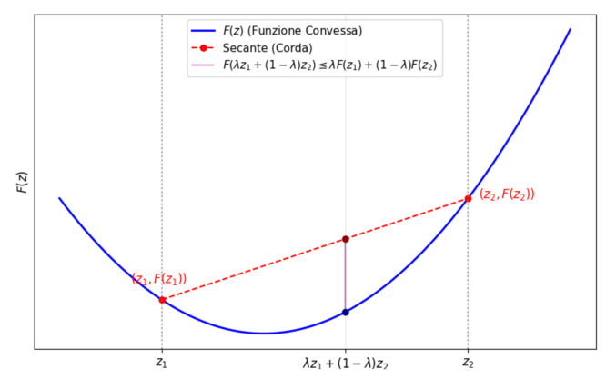

<h1 style="color:red;">Regressione in più dimensioni</h1>

In molti problemi reali, vogliamo prevedere il valore di una variabile dipendente partendo da molteplici variabili indipendenti.

**Dati a disposizione:** Abbiamo a disposizione un set di dati di addestramento composto da $m$ campioni: ${\{(x^{(i)}, y_i)\}}_{i=1}^m$.
* $x^{(i)} \in \mathbb{R}^p$: è un vettore le cui $p$ componenti sono chiamate **features** (caratteristiche o variabili indipendenti) dell'$i$-esimo campione.
* $y_i \in \mathbb{R}$: è il valore da prevedere, chiamato **risposta** (o target) associata all'$i$-esimo campione.

**Obiettivo:** Fissato un modello parametrico descritto da una funzione $f: \mathbb{R}^p \to \mathbb{R}$, dipendente da un set di parametri $\alpha_0, \ldots, \alpha_n$, vogliamo trovare i valori ottimali di tali parametri affinché il modello approssimi il più fedelmente possibile i dati reali:
$$f(\alpha_0, \ldots, \alpha_n; x^{(i)}) \approx y_i \quad \text{per } i=1, \ldots, m$$

> ### Criterio dei minimi quadrati
> Per quantificare l'errore del nostro modello, si utilizza la somma dei quadrati delle differenze (chiamati *residui*) tra il valore predetto e il valore reale. I parametri ideali sono quelli che minimizzano questa quantità:
> $$\min_{\alpha \in \mathbb{R}^{n+1}} \sum_{i=1}^{m} (f(\alpha_0, \ldots, \alpha_n; x^{(i)}) - y_i)^2$$

---

### Esempi di problemi multidimensionali

**1. Predizione del prezzo di una casa**
Vogliamo prevedere il prezzo in base a $p$ caratteristiche (features):
 - $y_i$: prezzo di vendita della casa $i\text{-esima}$ (**risposta**)
 - $x_1^{(i)}$: area della casa $i\text{-esima}$ (**feature 1**)
 - $x_2^{(i)}$: numero stanze della casa $i\text{-esima}$ (**feature 2**)
 - $x_3^{(i)}$: numero di bagni della casa $i\text{-esima}$ (**feature 3**)
 - $x_4^{(i)}$: 1 se in condominio, 0 se indipendente (**feature 4**, *variabile booleana*)
 - $x_5^{(i)}$: posizione (**feature 5**)

**2. Predizione del voto medio annuale di uno studente**
Un dataset ancora più complesso, con $m = 649$ studenti (campioni) e ben $p = 30$ features per ognuno. Le features includono variabili binarie (es. sesso, accesso a internet), numeriche (es. età, numero di assenze, tempo di studio) e nominali (es. lavoro dei genitori). 
La risposta $y_i$ è la media dei voti finali in matematica (da 0 a 20).

---

### Modello Lineare

Nel caso in cui assumiamo che la funzione $f$ sia una combinazione lineare delle sue features, poniamo il numero di parametri $n = p$ (un parametro per ogni feature, più l'intercetta $\alpha_0$). L'equazione del modello diventa:
$$f(\alpha_0, \ldots, \alpha_p; x^{(i)}) = \alpha_0 + \alpha_1 x_1^{(i)} + \alpha_2 x_2^{(i)} + \ldots + \alpha_p x_p^{(i)}$$

Possiamo esprimere il problema in forma matriciale compatta. Definiamo la **matrice di regressione $A$** (di dimensione $m \times (p+1)$) e il **vettore delle risposte $y$** (di dimensione $m \times 1$):

$$A = \begin{bmatrix} 1 & x_1^{(1)} & x_2^{(1)} & \ldots & x_p^{(1)} \\ 1 & x_1^{(2)} & x_2^{(2)} & \ldots & x_p^{(2)} \\ \vdots & \vdots & \vdots & \ddots & \vdots \\ 1 & x_1^{(m)} & x_2^{(m)} & \ldots & x_p^{(m)} \end{bmatrix} \quad \text{e} \quad y = \begin{bmatrix} y_1 \\ y_2 \\ \vdots \\ y_m \end{bmatrix}$$

> 💡 **Nota intuitiva:** Perché la matrice $A$ ha una colonna di tutti $1$ all'inizio? Quella colonna serve ad essere moltiplicata per il parametro $\alpha_0$ (l'intercetta, o *bias*). In questo modo, il prodotto riga per colonna $A\alpha$ ricostruisce esattamente l'equazione del modello lineare per ogni campione.

Inserendo questa formulazione matriciale, il criterio dei minimi quadrati assume la sua forma lineare classica: 
$$\min_{\alpha \in \mathbb{R}^{p+1}} \|A\alpha - y\|^2$$

---

<h1 style="color:red;">Problemi di regressione non lineare e ottimizzazione numerica</h1>

### Minimi quadrati non lineari

Non sempre una relazione lineare è sufficiente per descrivere la realtà. Se assumiamo che esista una funzione $f: \mathbb{R}^p \to \mathbb{R}$ dipendente da parametri $\alpha_0, \ldots, \alpha_{n-1}$ tale che:
$$f(\alpha_0, \ldots, \alpha_{n-1}; x^{(i)}) \approx y_i \quad \text{per } i=1, \ldots, m$$
L'obiettivo rimane trovare i parametri che minimizzano la funzione residuo:
$$F(\alpha) = \sum_{i=1}^{m} (f(\alpha_0, \ldots, \alpha_{n-1}; x^{(i)}) - y_i)^2$$

> ⚠️ **Concetto Chiave per l'Esame:** Si parla di modello "non lineare" quando la funzione $f$ NON dipende linearmente dai **parametri** $\alpha$, indipendentemente da come vi compaiono le $x$.
> * $f(x) = \alpha_0 + \alpha_1 \sin(x)$ è un modello **lineare** (perché $\alpha_0$ e $\alpha_1$ hanno grado 1).
> * $f(x) = \alpha_0 e^{\alpha_1 x}$ è un modello **non lineare** (perché $\alpha_1$ si trova all'esponente).

Se il modello è non lineare rispetto ai parametri, la funzione da minimizzare $F(\alpha)$ non può essere riscritta nella comoda forma algebrica matriciale $\|A\alpha - y\|^2$.
Di conseguenza, il problema non ammette quasi mai una soluzione esatta tramite risoluzione di sistemi lineari (equazioni normali), e diventa obbligatorio **ricorrere a metodi di ottimizzazione numerica iterativi** (es. Metodo del Gradiente, Gauss-Newton, Levenberg-Marquardt) per approssimare il minimo della funzione $F(\alpha)$.

### Esempi di Modelli Non Lineari: Dinamica delle Popolazioni

Un classico esempio di regressione non lineare riguarda lo studio della crescita di una popolazione nel tempo (ad esempio, il numero di antilopi in un parco africano o l'evoluzione della popolazione italiana dai censimenti ISTAT storici).
In questi casi, la feature $x$ è il tempo (es. anni) e la risposta $y$ è il numero di individui.

Esistono due modelli principali per descrivere questo fenomeno:

**1. Il Modello Esponenziale**
Il modello più semplice assume che il tasso di crescita della popolazione sia costante nel tempo. La funzione parametrica è:
$$f(\alpha_0, \alpha_1; x) = \alpha_0 e^{\alpha_1 x}$$
L'obiettivo è minimizzare la funzione residuo $F(\alpha_0, \alpha_1) = \sum_{i=1}^{m} (\alpha_0 e^{\alpha_1 x_i} - y_i)^2$ trovando i parametri ottimali $\alpha_0$ e $\alpha_1$.
*Limiti del modello:* Nella realtà, nessuna popolazione cresce all'infinito; le risorse limitate causano una stabilizzazione della crescita dopo un certo periodo.

**2. Il Modello Logistico**
Per superare i limiti dell'esponenziale, si utilizza la **funzione logistica**, che è molto più realistica e presenta un caratteristico grafico a forma di "S". 
Questo modello dipende tipicamente da tre parametri:
$$f(\alpha; x) = \frac{\alpha_0}{1 + e^{-\alpha_1(x - \alpha_2)}}$$
> 💡 **Nota intuitiva sui parametri del modello logistico:**
> * **$\alpha_0$**: Rappresenta il "tetto massimo" (o *carrying capacity*), ovvero il limite a cui la popolazione si stabilizza.
> * **$\alpha_1$**: Determina la ripidità della curva (quanto velocemente la popolazione cresce nella fase centrale).
> * **$\alpha_2$**: Rappresenta il punto di flesso, ovvero l'istante temporale $x$ in cui la crescita è massima prima di iniziare a rallentare.

---

<h1 style="color:red;">Il Problema di Ottimizzazione Numerica</h1>

Sia nei problemi di minimi quadrati non lineari, sia in altri contesti come la classificazione, l'obiettivo finale si riduce sempre alla minimizzazione di una determinata funzione, chiamata **funzione obiettivo** $F$.
Questo processo prende il nome di **ottimizzazione numerica non lineare** (o programmazione matematica non lineare).

Matematicamente, si formula come:
$$\min_{\alpha \in \mathbb{R}^n} F(\alpha) \quad \text{con } F: \mathbb{R}^n \to \mathbb{R}$$

### Minimi Locali e Minimi Globali

Quando cerchiamo il "minimo" di una funzione, dobbiamo distinguere due concetti:

* **Punto di minimo locale:** Un punto $\alpha^* \in \mathbb{R}^n$ è un minimo locale se è il punto più basso *solo nelle sue immediate vicinanze*. Formalmente, se esiste un raggio $\epsilon > 0$ tale che $F(\alpha^*) \le F(\alpha)$ per ogni $\alpha$ all'interno della palla $\{z \in \mathbb{R}^n : \|z - \alpha^*\| \le \epsilon\}$.
* **Punto di minimo globale:** Se la disuguaglianza $F(\alpha^*) \le F(\alpha)$ è valida per *tutti* i punti $\alpha \in \mathbb{R}^n$, allora $\alpha^*$ è il minimo globale assoluto della funzione. L'obiettivo ideale dell'ottimizzazione è sempre trovare il minimo globale.

### Equivalenza tra Problemi di Minimo e Massimo

I problemi di minimizzazione e massimizzazione sono due facce della stessa medaglia. Trovare il minimo di una funzione $F(\alpha)$ equivale esattamente a trovare il massimo della stessa funzione ribaltata (cambiata di segno):
$$\min_{\alpha \in \mathbb{R}^n} F(\alpha) \iff \max_{\alpha \in \mathbb{R}^n} -F(\alpha)$$
Le coordinate dei punti ottimali sono le stesse, mentre i valori della funzione $F$ nei punti di ottimo coincidono in valore assoluto ma avranno segno opposto.

---

### Condizioni Necessarie di Ottimalità

Come facciamo a sapere di aver trovato un punto di minimo? In una sola dimensione ($F: \mathbb{R} \to \mathbb{R}$), ci viene in soccorso il calcolo differenziale.

> ### Teorema di Fermat
> Se una funzione $F$ è differenziabile con continuità e $\alpha^* \in \mathbb{R}$ è un suo punto di minimo locale, allora la sua derivata prima in quel punto si annulla:
> $$F'(\alpha^*) = 0$$

**Conseguenze fondamentali per i Metodi Numerici:**
1.  **La ricerca:** Il problema di cercare i punti di minimo di una funzione $F$ si può tradurre (e spesso risolvere) come il problema della ricerca degli zeri della sua derivata prima $F'$. Tutti i punti di minimo devono obbligatoriamente soddisfare l'equazione $F'(\alpha) = 0$.
2.  **Il viceversa NON è sempre vero:** Sapere che $F'(\alpha) = 0$ è una condizione *necessaria ma non sufficiente* (il punto trovato potrebbe essere un massimo o un flesso/sella). La certezza che un punto a derivata nulla sia effettivamente un punto di minimo (condizione sufficiente) è garantita solo sotto ipotesi più stringenti, ad esempio se sappiamo a priori che la funzione $F$ è **convessa**.

<h2 style="color:blue;">Funzioni convesse</h2>

**Definizione**: Una funzione $F$ si dice convessa se
$$F(\lambda z_1 + (1-\lambda) z_2) \le \lambda F(z_1) + (1-\lambda) F(z_2) \quad \forall \lambda \in [0,1], \; z_1, z_2 \in \mathbb{R}^n$$

> 💡 **Significato intuitivo:** Geometricamente, questo significa che prendendo due punti qualsiasi sul grafico della funzione e unendoli con un segmento (secante o corda), questo segmento si troverà sempre *al di sopra* (o coinciderà) con il grafico della funzione stessa. Non ci sono "dossi".

> **Teorema (Convessità e Derivata Seconda)**  
> Sia $F: \mathbb{R} \to \mathbb{R}$ differenziabile due volte con continuità. Allora $F$ è convessa in $\mathbb{R}$ se e solo se:
> $$F''(\alpha) \ge 0 \quad \forall \alpha \in \mathbb{R}$$

### Condizioni necessarie e sufficienti di ottimalità per funzioni convesse

La convessità è una proprietà potentissima nell'ottimizzazione perché garantisce che non possiamo "rimanere incastrati" in falsi minimi.

> **Teorema (Minimo Locale $\implies$ Globale)**  
> Se $F: \mathbb{R} \to \mathbb{R}$ è convessa e $\alpha^*$ è un punto di minimo locale, allora è garantito che sia anche un **punto di minimo globale**.

> **Teorema (Condizione su $F'$ per funzioni convesse)**  
> Se $F: \mathbb{R} \to \mathbb{R}$ è convessa e differenziabile con continuità, allora $\alpha^*$ è un punto di minimo locale (e quindi globale) se e solo se $F'(\alpha^*) = 0$.
> *In sintesi: per le funzioni convesse, i punti di minimo globale sono tutti e soli le soluzioni dell'equazione $F'(\alpha) = 0$.*

---

<h2 style="color:blue;">Richiami di analisi matematica: derivate e gradiente</h2>

> **Definizione (Derivata prima in 1D)**  
> Sia $F: \mathbb{R} \to \mathbb{R}$ e $\bar{\alpha} \in \mathbb{R}$. La derivata prima in $\bar{\alpha}$ è:
> $$F'(\bar{\alpha}) = \lim_{h \to 0} \frac{F(\bar{\alpha} + h) - F(\bar{\alpha})}{h}$$

Quando passiamo a più dimensioni, la derivata viene calcolata "una variabile alla volta", tenendo costanti le altre. Queste si chiamano **derivate parziali**.

> **Definizione (Derivate parziali in 2D)**  
> Sia $F: \mathbb{R}^2 \to \mathbb{R}$. Le derivate parziali di $F$ in $\bar{\alpha} = (\bar{\alpha}_1, \bar{\alpha}_2)$ rispetto alla prima e alla seconda variabile sono:
> $$\frac{\partial F}{\partial \alpha_1}(\bar{\alpha}) = \lim_{h \to 0} \frac{F(\bar{\alpha}_1 + h, \bar{\alpha}_2) - F(\bar{\alpha}_1, \bar{\alpha}_2)}{h}$$
> $$\frac{\partial F}{\partial \alpha_2}(\bar{\alpha}) = \lim_{h \to 0} \frac{F(\bar{\alpha}_1, \bar{\alpha}_2 + h) - F(\bar{\alpha}_1, \bar{\alpha}_2)}{h}$$

### Il Gradiente e il Teorema di Fermat in $n$ dimensioni

> **Definizione (Gradiente)**  
> Il **gradiente** di $F$ in $\bar{\alpha} \in \mathbb{R}^n$ è il vettore colonna che raccoglie tutte le $n$ derivate parziali calcolate in quel punto:
> $$\nabla F(\bar{\alpha}) = \begin{bmatrix} \frac{\partial F}{\partial \alpha_1}(\bar{\alpha}) \\ \vdots \\ \frac{\partial F}{\partial \alpha_n}(\bar{\alpha}) \end{bmatrix}$$
> *Nota: Il gradiente indica sempre la direzione di massima pendenza (o massima salita) della funzione in quel punto.*

> **Teorema di Fermat in $\mathbb{R}^n$**  
> Sia $F: \mathbb{R}^n \to \mathbb{R}$ differenziabile in tutto $\mathbb{R}^n$ e sia $\alpha^* \in \mathbb{R}^n$ un suo **punto di minimo locale**. Allora il gradiente di $F$ in $\alpha^*$ si annulla, ovvero diventa il vettore nullo:
> $$\nabla F(\alpha^*) = 0$$

**Concetti chiave da ricordare:**
- Le radici del sistema $\nabla F(\alpha) = 0$ si chiamano **punti stazionari** di $F$.
- Tutti i punti di minimo sono punti stazionari (condizione necessaria).
- Un punto stazionario **non** è necessariamente un punto di minimo (potrebbe essere un massimo o un punto di sella). Il viceversa vale con certezza solo se la funzione è convessa.

---

### Esempi: Calcolo del gradiente per i minimi quadrati

Nei problemi di regressione, la funzione obiettivo da minimizzare ha spesso la forma di una somma di quadrati:
$$F(\alpha) = \sum_{i=1}^{m} (f(\alpha; x_i) - y_i)^2$$

Per calcolare le derivate parziali di questa funzione (e comporre il gradiente), si applica la **regola della catena della derivazione** (derivata della funzione esterna per derivata della funzione interna), ottenendo una formula generica comodissima:
$$\frac{\partial F(\alpha)}{\partial \alpha_j} = 2 \sum_{i=1}^{m} (f(\alpha; x_i) - y_i) \cdot \frac{\partial f(\alpha; x_i)}{\partial \alpha_j}$$

**Esempio sul Modello Esponenziale:** Data $F(\alpha) = \sum_{i=1}^{m} (\alpha_0 e^{\alpha_1 x_i} - y_i)^2$, il gradiente è composto da due derivate parziali:
1. Rispetto ad $\alpha_0$: $\frac{\partial F}{\partial \alpha_0} = 2 \sum_{i=1}^{m} (\alpha_0 e^{\alpha_1 x_i} - y_i) \cdot e^{\alpha_1 x_i}$
2. Rispetto ad $\alpha_1$: $\frac{\partial F}{\partial \alpha_1} = 2 \sum_{i=1}^{m} (\alpha_0 e^{\alpha_1 x_i} - y_i) \cdot (\alpha_0 x_i e^{\alpha_1 x_i})$

---

<h2 style="color: blue;">Metodo del gradiente (Steepest Descent)</h2>

Consideriamo il problema di minimizzazione non lineare nella variabile $\alpha \in \mathbb{R}^n$:
$$\min_{\alpha \in \mathbb{R}^n} F(\alpha)$$

Il metodo del gradiente è un *metodo iterativo* che parte da un'approssimazione iniziale $\alpha^{(0)} \in \mathbb{R}^n$ e costruisce una successione di punti definita dalla formula ricorsiva: 
$$\alpha^{(k+1)} = \alpha^{(k)} - \gamma_k \nabla F(\alpha^{(k)}) \quad k = 0, 1, 2, \ldots$$

> 💡 **Perché il segno meno?** Poiché il gradiente $\nabla F$ punta sempre verso la direzione di *massima salita*, per trovare il minimo dobbiamo muoverci nella direzione opposta, ovvero $-\nabla F$ (direzione di *massima discesa*).

Il termine $\gamma_k > 0$ è chiamato parametro di **steplength** (lunghezza del passo). La sua scelta è cruciale per le proprietà di convergenza:
1. **Passo fisso**: $\gamma_k = \gamma$ costante per ogni $k$. Facile da implementare ma potenzialmente lento o instabile.
2. **Passo variabile**: $\gamma_k$ viene adattato dinamicamente ad ogni iterazione per ottimizzare la discesa.

### Proprietà di discesa: Perché il metodo funziona? (Dimostrazione in $\mathbb{R}$)

Vogliamo dimostrare che muovendosi in direzione opposta al gradiente (o alla derivata prima in 1D), il valore della funzione effettivamente diminuisce.

Consideriamo il caso $n=1$, con $F \in C^2(\mathbb{R})$ e supponiamo che la derivata seconda sia limitata superiormente: $F''(\alpha) \le L$ per ogni $\alpha$.
Sviluppiamo $F$ con il **Teorema di Taylor** partendo dal punto $\alpha$, applicando uno spostamento generico $\gamma d$:
$$F(\alpha + \gamma d) = F(\alpha) + \gamma d \cdot F'(\alpha) + \frac{1}{2} \gamma^2 d^2 F''(\xi)$$

Ora **scegliamo come direzione $d$ l'opposto del gradiente**, quindi $d = -F'(\alpha)$, e sostituiamo usando la maggiorazione $F'' \le L$:
$$F(\alpha - \gamma F'(\alpha)) \le F(\alpha) - \gamma (F'(\alpha))^2 + \gamma^2 \frac{L}{2} (F'(\alpha))^2$$

Raccogliendo a fattor comune $\gamma (F'(\alpha))^2$ otteniamo:
$$F(\alpha - \gamma F'(\alpha)) \le F(\alpha) - \gamma (F'(\alpha))^2 \left( 1 - \gamma \frac{L}{2} \right)$$

**Conclusione fondamentale:**
Affinché il nuovo valore della funzione sia *strettamente minore* di quello vecchio ($F_{nuovo} < F_{vecchio}$), la quantità sottratta deve essere positiva. Questo succede se e solo se la parentesi è positiva:
$$1 - \gamma \frac{L}{2} > 0 \iff \gamma < \frac{2}{L}$$

*Cosa significa in pratica?* Se ci spostiamo in direzione opposta al gradiente, e se lo spostamento $\gamma$ è **sufficientemente piccolo** (minore di un certo limite $\frac{2}{L}$), abbiamo la garanzia matematica di trovare un punto in cui la funzione ha un valore inferiore rispetto alla partenza.

<h2 style="color:blue;">Estensione in più dimensioni e Lemma di discesa</h2>

Le osservazioni fatte in una dimensione si estendono allo spazio $\mathbb{R}^n$ sostituendo la derivata prima $F'(\alpha)$ con il gradiente $\nabla F(\alpha)$. 
Tuttavia, la condizione di avere una derivata seconda limitata viene sostituita con un'ipotesi leggermente più morbida sul gradiente.

**Definizione: Lipschitzianità del gradiente**
Il gradiente di $F$ si dice Lipschitziano di costante $L$ se vale la seguente disuguaglianza per ogni coppia di punti $u, v \in \mathbb{R}^n$:
$$||\nabla F(u) - \nabla F(v)|| \le L||u - v||$$
> 💡 **Nota intuitiva:** Questa proprietà ci assicura che il gradiente "non impazzisca". Ovvero, se ci spostiamo di poco nello spazio, anche la pendenza della funzione cambierà di poco. La curvatura della funzione è limitata dalla costante $L$.

> **Lemma di discesa**  
> Sia $F: \mathbb{R}^n \to \mathbb{R}$ una funzione differenziabile con continuità, con gradiente Lipschitziano di costante $L$. Allora per ogni punto $\alpha$, per ogni direzione $d \in \mathbb{R}^n$ e per ogni $\gamma > 0$ si ha:
> $$F(\alpha + \gamma d) \le F(\alpha) + \gamma d^T \nabla F(\alpha) + \frac{L}{2}\gamma^2||d||^2$$

Se applichiamo questo lemma scegliendo come direzione l'opposto del gradiente ($d = -\nabla F(\alpha)$), otteniamo:
$$F(\alpha - \gamma \nabla F(\alpha)) \le F(\alpha) - \gamma||\nabla F(\alpha)||^2 \left(1 - \frac{L}{2}\gamma\right)$$

Affinché la funzione decresca (cioè il nuovo valore sia strettamente minore di quello vecchio), la quantità sottratta deve essere positiva. Questo avviene se:
$$1 - \frac{L}{2}\gamma > 0 \iff \gamma < \frac{2}{L}$$

---

### Convergenza del metodo del gradiente a passo fisso

> **Teorema**  
> Sia $F: \mathbb{R}^n \to \mathbb{R}$ differenziabile con continuità, dotata di almeno un punto di minimo e con gradiente Lipschitziano di costante $L$. 
> Se generiamo la successione $\alpha^{(k+1)} = \alpha^{(k)} - \gamma \nabla F(\alpha^{(k)})$ con un passo costante $\gamma < \frac{2}{L}$, allora qualsiasi punto di accumulazione della successione è un **punto stazionario** di $F$.
> Se, in aggiunta, $F$ è **convessa**, la successione converge esattamente a un **punto di minimo** di $F$.

---

<h2 style="color:blue;">Criteri di Arresto</h2>

Un metodo iterativo ha bisogno di una condizione per fermarsi. Nel metodo del gradiente, il criterio di arresto principale si basa sul Teorema di Fermat.

1. **Criterio sulla norma del gradiente:**
   $$||\nabla F(\alpha^{(k)})|| \le \tau$$
   Ci si ferma quando la norma del gradiente scende sotto una certa tolleranza prestabilita $\tau$. Essendo il gradiente nullo nei punti stazionari (condizione necessaria di ottimalità), un gradiente "quasi zero" indica che siamo molto vicini al minimo.

2. **Criterio sul residuo della funzione (opzionale/combinato):**
   In certi casi, si controlla anche che il valore della funzione non stia più cambiando significativamente tra un passo e l'altro: $$\frac{F(\alpha^{(k)}) - F(\alpha^{(k+1)})}{|F(\alpha^{(k)})|} \le \tau$$ 

---

<h2 style="color:blue;">Scelta adattiva del passo: Regola di Armijo (Backtracking)</h2>

Scegliere un passo $\gamma$ fisso a priori è spesso inefficiente. La soluzione migliore è ricalcolarlo dinamicamente ad ogni iterazione tramite un algoritmo chiamato **ciclo di backtracking** basato sulla **Regola di Armijo**.

L'idea di base è partire con un passo molto lungo di tentativo ($s$) e ridurlo progressivamente moltiplicandolo per un fattore fisso $\beta$ finché la decrescita della funzione non è soddisfacente.

**Procedura di backtracking con la regola di Armijo**
* **Input:** Punto attuale $\alpha^{(k)}$, gradiente $\nabla F(\alpha^{(k)})$; tentativo iniziale $s > 0$; parametri di controllo $\beta, \sigma \in (0,1)$.
* **Inizializzazione:** Si imposta il passo di tentativo $\gamma^+ \leftarrow s$.
* **Ciclo WHILE:** Finché la discesa *non* è sufficiente, ovvero finché vale:
    $$F(\alpha^{(k)} - \gamma^+ \nabla F(\alpha^{(k)})) > F(\alpha^{(k)}) - \sigma \gamma^+ ||\nabla F(\alpha^{(k)})||^2$$
    Si riduce il passo: $\gamma^+ \leftarrow \beta \gamma^+$.
* **Output:** Non appena la disuguaglianza del ciclo diventa falsa, si esce dal loop e si accetta il passo trovato: $\gamma_k \leftarrow \gamma^+$.

> 💡 **Cosa garantisce questo ciclo?**
> Alla fine del ciclo, avremo accettato un parametro $\gamma_k$ tale per cui vale:
> $$F(\alpha^{(k+1)}) \le F(\alpha^{(k)}) - \sigma \gamma_k ||\nabla F(\alpha^{(k)})||^2$$
> Questo assicura matematicamente una "sufficiente decrescita" del valore della funzione.

### Pseudocodice completo del Metodo del Gradiente con Armijo

L'algoritmo si configura come un doppio ciclo (un loop esterno per le iterazioni di discesa e un loop interno per la scelta del passo).
* **Input:** Punto di partenza $\alpha^{(0)}$; tolleranza $\tau > 0$; parametri $\beta, \sigma \in (0,1)$ e passo massimo $s > 0$.
* **FOR** $k = 0, 1, 2, \ldots$
    * **STEP 1.** Calcola il gradiente $\nabla F(\alpha^{(k)})$.
        * **IF** $||\nabla F(\alpha^{(k)})|| \le \tau$ **THEN RETURN** $\alpha^{(k)}$ (criterio di arresto soddisfatto).
    * **STEP 2. Backtracking:** 
        * **STEP 2.1** Inizializza $\gamma^+ \leftarrow s$.
        * **STEP 2.2 WHILE** $F(\alpha^{(k)} - \gamma^+ \nabla F(\alpha^{(k)})) > F(\alpha^{(k)}) - \sigma \gamma^+ ||\nabla F(\alpha^{(k)})||^2$
            * $\gamma^+ \leftarrow \beta \gamma^+$ (riduci il passo)
        * **STEP 2.3** Assegna $\gamma_k \leftarrow \gamma^+$
    * **STEP 3.** Calcola il nuovo punto applicando lo spostamento:
        $$\alpha^{(k+1)} = \alpha^{(k)} - \gamma_k \nabla F(\alpha^{(k)})$$
* **END FOR**

### Convergenza con Regola di Armijo

La regola di Armijo garantisce ottime proprietà teoriche senza dover conoscere a priori la costante $L$ del gradiente.

> **Teorema**  
> Se $F: \mathbb{R}^n \to \mathbb{R}$ è differenziabile con continuità e ha almeno un punto di minimo, la successione generata dal metodo del gradiente con passo calcolato via backtracking di Armijo possiede punti di accumulazione che sono tutti **punti stazionari** di $F$.
> Se, inoltre, $F$ è **convessa**, allora la successione convergerà certamente a un **punto di minimo** di $F$.

<h1 style="color:red;">Altri problemi di ottimizzazione: Classificazione Binaria</h1>

Oltre a prevedere valori continui (come il prezzo di una casa), l'ottimizzazione non lineare serve per i **problemi di classificazione**, dove la variabile di risposta $y_i$ assume solo un numero finito di valori (chiamati *etichette* o *label*).

Nel caso della **classificazione binaria**, le categorie possibili sono solo due, tipicamente associate ai valori discreti: 
$$y_i \in \{-1, +1\} \quad \text{oppure} \quad y_i \in \{0, 1\}$$

### Esempio pratico: Riconoscimento di cifre (MNIST dataset)
Immaginiamo di voler istruire un computer a riconoscere se una cifra scritta a mano è un "8" oppure no.
* **Input (Features):** Un'immagine di 28x28 pixel. Ogni pixel è una feature, quindi abbiamo $p = 784$ features per ogni immagine $x^{(i)} \in \mathbb{R}^{784}$.
* **Output (Risposta):** $y_i = 1$ se l'immagine rappresenta un 8, altrimenti $y_i = 0$.

---

### Dall'Iperpiano Separatore al Modello Lineare-Logistico

**L'approccio "ideale" (ma problematico):**
Assumiamo che esista un "iperpiano" (una superficie piatta multi-dimensionale) in grado di separare perfettamente i campioni della classe 0 da quelli della classe 1. L'equazione di questo iperpiano è $\alpha_0 + \alpha_1 x_1 + \ldots + \alpha_p x_p = 0$.
Potremmo usare una **funzione a gradino** per classificare: se il risultato dell'equazione è $> 0$, assegniamo 1; altrimenti assegniamo 0. L'obiettivo sarebbe massimizzare il numero di campioni corretti.
> ⚠️ **Il problema:** La funzione a gradino non è continua e la sua derivata è nulla ovunque (tranne nel salto, dove non è definita). Questo rende *impossibile* usare il metodo del gradiente per trovare i parametri $\alpha$!

**La soluzione: Classificazione Lineare-Logistica:**
Per risolvere il problema matematico, si sostituisce la spigolosa funzione a gradino con una sua approssimazione "morbida" e derivabile: la **funzione sigmoide** $\sigma(t)$.
$$\sigma(t) = \frac{1}{1 + e^{-t}}$$

Il modello predittivo diventa quindi:
$$f(\alpha; x) = \sigma(\alpha_0 + \alpha_1 x_1 + \ldots + \alpha_p x_p)$$

---

<h2 style="color:blue;">Analisi del problema di ottimizzazione</h2>

Con la funzione sigmoide, anziché massimizzare i conteggi secchi, formuliamo un problema di minimizzazione della **funzione obiettivo** (chiamata in questo ambito *Loss function*):
$$F(\alpha) = -\frac{1}{m} \sum_{i=1}^{m} \left( y_i(\alpha_0 + \alpha_1 x_1^{(i)} + \ldots + \alpha_p x_p^{(i)}) - \log(1 + e^{\alpha_0 + \alpha_1 x_1^{(i)} + \ldots + \alpha_p x_p^{(i)}}) \right)$$

### Vantaggi matematici del modello logistico
1. **Calcolo del gradiente efficiente:** In forma matriciale compatta, il gradiente della funzione Loss si calcola elegantemente come:
   $$\nabla F(\alpha) = \frac{1}{m} A^T (z - y)$$
   (dove $z$ è il vettore delle previsioni del modello $f(\alpha; x^{(i)})$ per ogni campione).
2. **Ottimalità garantita:** Si dimostra analiticamente che questa funzione $F(\alpha)$ è **convessa**. Questo significa che il nostro Metodo del Gradiente troverà sempre il minimo globale!
3. **Passo di discesa controllabile:** Il gradiente è Lipschitziano con una costante $L$ legata alla matrice dei dati $A$. Poiché $L \le \frac{1}{4m}(\sigma_1)^2$ (dove $\sigma_1$ è il più grande valore singolare di $A$), e calcolare $\sigma_1$ è troppo oneroso, nella pratica si usa la approssimazione con la norma di Frobenius $\sigma_1 \le ||A||_F$.

### Come fa il modello a decidere? (Classificatore finale)
Una volta allenato il modello e trovati i parametri ottimali $\alpha^*$, se arriva una nuova immagine $x$, il modello calcola la probabilità $f(\alpha^*; x)$ usando la sigmoide.
La regola decisionale finale usa la soglia del $50\%$:
* Classe **1** se $f(\alpha^*; x) > \frac{1}{2}$.
* Classe **0** se $f(\alpha^*; x) \le \frac{1}{2}$.

---

<h2 style="color:blue;">Ottimizzazione su larga scala e Reti Neurali</h2>

### Implementazione a Minibatch (Stochastic Gradient Descent)
Quando il dataset è immenso (come decine di migliaia di immagini), calcolare l'intero gradiente esatto ad ogni passo $\nabla F(\alpha)$ diventa troppo lento. 
La soluzione è il metodo a **minibatch**:
1. Ad ogni iterazione $k$, si seleziona solo un piccolo sottoinsieme casuale di campioni $\mathcal{N}_k$ (il batch) di dimensione $N_k$.
2. Si calcola un *gradiente medio approssimato* solo su quel sottoinsieme: $g^{(k)} = \frac{1}{N_k} \sum_{i \in \mathcal{N}_k} \nabla F_i(\alpha^{(k)})$.
3. Si aggiorna il punto: $\alpha^{(k+1)} = \alpha^{(k)} - \gamma g^{(k)}$.

### Dal Modello Logistico alle Reti Neurali
Un classificatore logistico non è altro che il blocco base fondamentale (il singolo neurone artificiale) del Deep Learning!
* **Neurone singolo (Reg. Logistica):** $z = \sigma(wx + b)$ (prende l'input, fa una combinazione lineare e applica la sigmoide).
* **Rete Neurale (Multilayer):** Concatena multipli "neuroni" su più livelli nascosti. Ad esempio, l'output di un livello diventa l'input del livello successivo: 
  $$z = \sigma_2(w^{(2)}\sigma_1(w^{(1)}x + b_1) + b_2)$$
In entrambi i casi, l'addestramento della rete neurale corrisponde esattamente allo stesso problema di Metodi Numerici visto finora: risolvere il problema di ottimizzazione $\min F(\alpha)$ per trovare i "pesi" ideali!